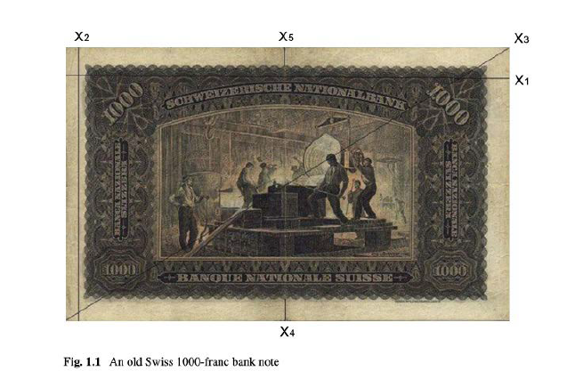
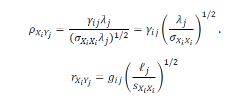
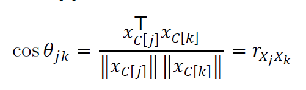

# PCA

```{r setup, include=F, warning=F, message=F, echo=F}
knitr::opts_chunk$set(echo = TRUE)
library(tidyverse)
library(knitr)
```

PCA 全名 Principal Component Analysis ，中文名字為主成分分析，主要是用來解決共線性以及變數過多的問題，這種方法十分基本也好用，所以廣受大家喜愛，路上隨便抓一個路人都會說他會做PCA，如果你現在不會的話也沒有關係，希望看完這個後大家會知道 PCA 的原理還有如何看分析結過。

以下會有一些數學算式，看不懂就算了其實沒關係，因為弄懂他並不會讓人生更快樂。


```{r include=F, warning=F, message=F, echo=F}
x <- read.table("bank2.dat")
```

```{r include=T, echo=T, warning=F, message=F}
x.new <- x %>% mutate(real = c(rep("real",100), rep("fake",100)))
#前一百筆是真鈔資料，後一百筆是假鈔資料。 
```

```{r include=T, echo=T, warning=F, message=F}
head(x) %>% kable()
```

```{r  echo=FALSE, fig.cap="A caption", out.width = '100%'}

```
以上為$X_1 \sim X_6$($V_1 \sim V_6$)的意思。（希望看得懂啦~）

接著要對他們做 PCA 的！一步一步慢慢來。

### 第一步：標準化

$$X_{std} = \frac{X-\mu}{\sigma}$$

$$\mathcal{X^*=C_nXD^{-1/2}}$$ 

 $C_n$ Cnetering Matrix：
 這個矩陣的目的就是讓全部的$X$都減去$\bar{X}$

$$C_n = I_n-\frac{1}{n}J_n$$
$J_n$為所有元素都是1的矩陣。

例如；
$$C_2 = \begin{bmatrix}1 &0 \\0 & 1\end{bmatrix}-\frac{1}{2}\begin{bmatrix}1 &1 \\1 & 1\end{bmatrix} = \begin{bmatrix}\frac{1}{2} &-\frac{1}{2}\\-\frac{1}{2} & \frac{1}{2}\end{bmatrix}$$

$\mathcal{D}$ 為對角線$S_{x_i}{x_i}}$的對角矩陣。

$\lambda = (\lambda_1, \lambda_2, ...\lambda_p)$ 為 $\mathcal{X^*}'\mathcal{X^*}$的 eigenvalues，$\mathcal{V} = (v_1, v_2,...v_p)$是對應的 eigenvactors。

```{r}
n = nrow(x) # 幾個觀察值（幾張鈔票）
p = ncol(x) # 幾個獨立變量（總共觀察幾個東西）
```

$C_n$
```{r}
J_n <-  matrix(1, n, n) #都是1的矩陣
I_n <- diag(1,n,n)
C_n <- I_n-(1/n)*J_n
```

$D^{-1/2}$
```{r}
d = diag(c(sd(x$V1)^-1, sd(x$V2)^-1, sd(x$V3)^-1, sd(x$V4)^-1, sd(x$V5)^-1, sd(x$V6)^-1))
```
```{r}
xs = (C_n %*% (as.matrix(x))%*% (d))
xs2 = (1/(n-1))*t(xs) %*% xs
```


### eigenvalues、 eigenvectors

```{r}
eig = eigen(xs2)  # spectral decomposition
lambda = eig$values
gamma = eig$vectors
```

- 直接使用
```{r}
x = scale(x)
eig = eigen(cov(x))  # spectral decomposition
lambda = eig$values
gamma = eig$vectors
```

其中eigenvectors彼此之間互相獨立（內積為零），也就是線性組合出來新的值不具共線性。

 eigenvalues 表示該組合所含的變異，變異越多越好，表示可以將每個自變量的不同表示的越徹底，也就是說喪失的資訊量越少，所以eigenvalues都從大的開始挑，通常挑到可以解釋的百分之七八十（看自己定義啦，社會科學要求較低，約七八十就可以，畢竟人很複雜的；但是工業統計就會要求很高，通常要九十以上。）
 
 要如何看包含的變異呢，通常就是以下這個公式：
 
 $$
 \lambda_1\ \geq\lambda_2 \geq ...\geq\lambda_p\ ; \ 
 V = \frac{\sum_{i=1}^k\lambda_i}{\sum_{i=1}^p\lambda_i}\ ; \ k \leq p
 $$
 
當這個數值達到你要的變異量($V$)的最小的k，就是你要的$\lambda$的量。
 
```{r}
lambda.sum <- lambda %>% sum
lambda.dt <- data.frame(X=c(1:p),
                        lambda = lambda, 
                        cum =cumsum(lambda/lambda.sum))

lambda.dt %>% round(3)%>% kable()
```

```{r}
ggplot(lambda.dt)+
  geom_point(mapping = aes(x = c(1:p), y = cum))+
  geom_path(aes(x = c(1:p), y = cum, group = 1))+
  ylim(c(0.4,1.02))+
  labs(x = "lambda",
       y = "累加")
```
由上方表格可以看出，到第三個eigenvalue 就已經解釋變異的量就已經達到 80%，所以我們就決定使用$\lambda_1,\lambda_2,\lambda_3$ ，那他對應的eigenvector 分別為：

```{r}
gamma[,1:3]
```

### 線性組合

重新經過線性組合的變量為：

$$y_i = Xv_i$$

```{r}
y <- as.matrix(x) %*% gamma[,1:3]
y <- y %>% as.data.frame()
y %>% head()
```
```{r}
y.new <- y %>% mutate(real = c(rep("real",100), rep("fake",100)))
```


### 主成分之組成

用圖形可以看一下主成分的組成，首先
```{r}
gamma = eig$vectors
gamma = add_column(gamma %>% as.data.frame(), V0 = c("X1","X2","X3","X4","X5","X6"), .before = 1)

gamma.01 <- data.frame(PC = as.character(),V0 = as.character(),loading = as.numeric() )
colnames(gamma) <- c("V0", rep("loading", 6))

for (i in 1:6) {
  a <- gamma[,c(1,i+1)]
  a <- add_column(a, PC = rep(i, nrow(a)),  .before = 1)
  gamma.01 <- rbind(gamma.01, a)
}
gamma.01[,1] <- as.character(gamma.01[,1]) 


  ggplot(gamma.01)+
  geom_point(aes( x = V0, y=loading, color = PC))+
  geom_path(aes( x = V0, y=loading, color = PC, group =PC), size = 1)+
  geom_hline(aes(yintercept=0), colour="#990000", linetype="dashed")
  
  
```

上圖為每個原始變數在每個主成分的所佔的比重，可以看出X1在第一主成分幾乎等於零，而影響第一主成分比重最高的是X4（正的）與X6(負的)。

```{r}
PC12 <-ggplot(y.new)+
  geom_point(mapping = aes(x = V1, y = V2, color = real))+
  labs(x = "PC1", y = "PC2")

PC13 <- ggplot(y.new)+
  geom_point(mapping = aes(x = V1, y = V3, color = real))+
  labs(x = "PC1", y = "PC3")

PC23 <-ggplot(y.new)+
  geom_point(mapping = aes(x = V2, y = V3, color = real))+
  labs(x = "PC2", y = "PC3")

library(gridExtra)
grid.arrange(PC12 , PC13, PC23 , ncol = 2)
```

上圖可以看出，用 PC1、PC2 保存了大部分的變異，也就是說只要用到 $y_1、y_2$ 就可以分辨大部份的真鈔和假鈔。

```{r}
PC1 <- ggplot(y.new)+
  geom_bar(aes(x = V1, color = real))+
  labs(x = "PC1")

PC2<-ggplot(y.new)+
  geom_bar(aes(x = V2, color = real))+
  labs(x = "PC2")

PC3 <-ggplot(y.new)+
  geom_bar(aes(x = V3, color = real))+
  labs(x = "PC3")

grid.arrange(PC1 , PC2, PC3 , ncol = 2)

```

上面三張圖可以看到其實PC1就分辨真鈔與偽鈔，PC2也可以分辨大部分的真鈔偽鈔，但是表現沒有PC1優秀，而PC3則是一團亂。

### 看彼此關係
```{r}
library(tibble)
b <- gamma[,1:3] %>% as.data.frame()
add_column(b, V0 = c("X1","X2","X3","X4","X5","X6"), .before = 1)
```


#### 相關係數

以下算式為Y和X的相關係數，其中 $g_{i}$ 為 $\gamma_{i}$ (eigenvector)
的估計值，而$l_i$為$\lambda_i$的估計值。
```{r  , echo=FALSE, fig.cap="A caption", out.width = '100%'}

```
注意：
$$
\sum^p_{j=1}r_{X_iY_j}^2 = \frac{\sum^p_{j=1}l_jg_{ij}^2}{S_{X_iX_i}}= \frac{S_{X_iX_i}}{S_{X_iX_i}}=1
$$

如果以這個例子我們只用前面兩個主成分的話，$r_{X_iY_1}^2+r_{X_iY_2}^2$ 為第$X_i$ 的變數被轉換成 $Y_1、Y_2$ 這兩個主成分後可以解釋的比例，接近1表示 $X_i$ 差不多被$Y_1、Y_2$ 解釋完了。

```{r}
gamma <- eig$vectors %>% as.matrix()
lambda.m <- diag(lambda.dt$lambda %>% sqrt) %>% as.matrix()
R <- gamma %*% lambda.m
R <- data.frame(X = c(1:p),
                ri1 = R[,1],
                ri2 = R[,2],
                ri1.2ri2.2=(R[,1]^2+R[,2]^2)) 

R
```

ri1 這一行表示$y_1$與$x_i$的關係，這裡的關係都是相對的不是絕對，這裡可以看到$x_1$和$y_1$的關係很少，近乎零，$x_2$和$y_1$的相關係數為`r R[2,2]`，很接近1，表示$y_2$和$x_2$有很大的關係。

先只看PC1與PC2兩個的關係
```{r fig.height=9, fig.width=9}
library(gcookbook)
library(ggrepel)

# 為了畫圓圈
circleFun <- function(center = c(0,0),diameter = 1, npoints = 100){
  r = diameter / 2
  tt <- seq(0,2*pi,length.out = npoints)
  xx <- center[1] + r * cos(tt)
  yy <- center[2] + r * sin(tt)
  return(data.frame(x = xx, y = yy))
}
 
dat <- circleFun(c(0,0),diameter =2,npoints = 100) #diameter:直徑；c(0,0):圓心


cor.12_plot <- ggplot(R)+
  geom_point(mapping = aes(x = ri1, y = ri2))+
  geom_text_repel(aes(x = ri1, y = ri2,label = X), size = 6)+
  geom_path(dat,mapping=aes(x,y))+
  geom_hline(aes(yintercept=0), colour="#990000", linetype="dashed")+
  geom_vline(aes(xintercept=0), colour="#990000", linetype="dashed")

cor.12_plot
```

該變量離圓心越遠，也就是$\sqrt{r_{X_iY_i}^2}$ 越大，就表示 PC1 與 PC2 可以解釋該變量越多。

但是這張圖真的很厲害，不只可以看出x與y之間的關係，也可以看出x之間的關係。

```{r  , echo=FALSE, fig.cap="A caption", out.width = '100%'}

```
  
```{r fig.height=9, fig.width=9}
cor.12_plot+ geom_segment(data = R, aes(xend = R[ ,2], yend=R[ ,3]),
              x=0, y=0, colour="black",
              arrow=arrow(angle=25, length=unit(0.25, "cm")))
```

從上面的式子可以知道，x之間的關係和上圖中兩個變數之間的夾角的cos值，例如$X_4、X_6$的夾角機乎是180度，所以他們的$r_{X_4X_6}$ 就很接近$cos\pi= -1$，表示兩個為負相關，而如果兩個變數的夾角為直角90度，他們的$r$為0，就是兩者不相關，而如果兩個變數很靠近(例如2和3這一組或是4和5這一)就表示兩者的關係很大，接近1。

請注意，因為PC1 與PC2 只可以解釋全部變異中的70%左右，因此所說的$r_{X_iX_j}$是在這70%中的變異中所呈現的關係，不能代表全部的關係。


## 直接用內建的 package 做
```{r}
library(ggfortify)
pca_res <- prcomp(x, scale= T)
pca_res$sdev #其中 pca_res$sdev 的平方 = lambda
```


```{r}
autoplot(pca_res, data = x.new, colour = 'real')
```

```{r}
autoplot(pca_res, data = x.new, colour = 'real',loadings = TRUE, loadings.label = TRUE,)
```
看到圖不一樣不要緊張，因為向量可能全部差一個負號。
