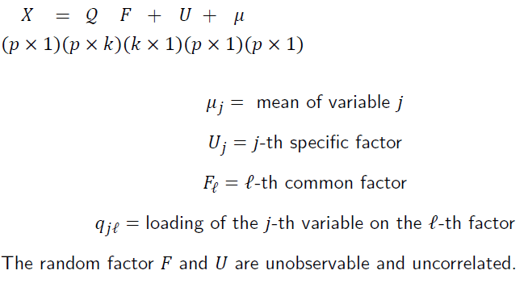

#  因素分析 (Factor Analysis)

## 作用

因子分析主要是找出資料的結構，抑或是**潛藏因子（Latent factor）**，以少數幾個因素來解釋一群互相可能會有關係的變數，達到**降維**的效果，但是同時又不失去其他的訊息，使變數達到精簡。

## 模型

先從基本的來：
$$
\begin{gather*}
X = QF+\mu
\\\\
E(X) = \mu; \\
 QF = 0; \\ E(F) = 0;\\
 Var(F) = I_k
\\\\
Var(X) = \Sigma = \Gamma\Lambda\Gamma^{T} =\begin{pmatrix}\Gamma_1&\Gamma_2\end{pmatrix} \begin{pmatrix}\Lambda_1&0\\0&0\end{pmatrix}
\begin{pmatrix}\Gamma_1^T\\\Gamma_2^T\end{pmatrix} 
\end{gather*}
$$
$\lambda_{k+1} = \lambda_{k+2} = ... =\lambda_{p} = 0$，表示前面k個$\lambda$就已經包含所有的變異。

令

$$
\begin{gather*}
Y = \begin{pmatrix}Y_1\\Y_2\end{pmatrix} = \begin{pmatrix}\Gamma_1^T\\\Gamma_2^T\end{pmatrix} \begin{pmatrix}X-\mu\end{pmatrix} \sim (0, \begin{pmatrix}\Lambda_1&0\\0&0\end{pmatrix} )
\end{gather*}
$$

1. 沒有常態假設！！
2. $Y_2$服從期望值為0的退化分配， 就是說永遠都等於0
3. 矩陣相乘表示在eigenvectors 上的投影，Y 就是投影的新變數！
4. $F$ 為共同因素(Common Factor)，就是所有的變數會受到它影響。

$$
\begin{gather*}
\because 
\begin{pmatrix}\Gamma_1&\Gamma_2\end{pmatrix} 
\begin{pmatrix}\Gamma_1^T\\\Gamma_2^T\end{pmatrix}  = I_p\\
\\
\therefore \begin{pmatrix}\Gamma_1&\Gamma_2\end{pmatrix}  \begin{pmatrix}Y_1\\Y_2\end{pmatrix} = \begin{pmatrix}X-\mu\end{pmatrix} 
\\\\
X = \Gamma_1Y_1+\Gamma_2Y_2+\mu=\Gamma_1Y_1+\mu=(\Gamma_1\Lambda_1^{1/2})(\Lambda_1^{-1/2}Y_1)+\mu
\end{gather*}
$$
因此：                                                        
$$
Q = \Gamma_1\Lambda_1^{1/2}\ ; \ F = \Lambda_1^{-1/2}Y_1
$$

這表示$Q$包含了所有$X$的共同變異。

但是因子分析想要的更多，不只要共同的變異，也想要知道個別的變異，一般來說個別的變異會包含在殘差中（$\epsilon$），但是在因子分析中我們把它歸類成個別變異($U$)，就是自己獨有的變異，我們希望這個變異越少越好，不然很難做事啊！

$$
\begin{gather*}
X = QF+\mu+\epsilon = QF+\mu+U\\(U 為X自己的變異) 
\\
x_i = \sum_{l = 1}^k{q_{lj}f_l}+\mu_i+\epsilon_i
\end{gather*}
$$
該模型假設有：
- $E(F) = 0$
- $Var(F) = I_k$
- $E(U) = 0$
- $cov(U_i,U_j) = 0$
- $Var(U) = \Psi = \begin{pmatrix}\psi_{11}&0&...&0\\0&\psi_{22}&...&0\\...&...&...&...\\0&0&...&\psi_{pp}\end{pmatrix}$

若符合以上的假設，我們就將這個模型稱之為**Orthogonal Factor Model**。

```{r  echo=FALSE, fig.cap="A caption", out.width = '100%'}

```
- $F$: 為共同因子 (Common Factor)，表示大家都有的因素

- $U$: 為特定因子 (Specific Factor)，表示只有自己有的因素。

- $Q$: 包含所有的變異，且為該$X_j$由各其他各潛藏因子(latent factors)組成的比重（loading），注意，這並不是唯一的，因為降維的關係所以通常可以旋轉，（例如一個平面降維到一條線，所以會有無限多條線，所以主要就是找到那個最好解釋的組合。）

其中，X自己的變異包含的共同因子變異$\sum_{l = 1}^k{q_{lj}^2}$與特定因子變異$\psi_{jj}$，前面那個是大家都有的，後面那個是只有自己有的。
所以：
$$
\sigma_{X_jX_j} = Var(X_j) = \sum_{l = 1}^k{q_{lj}^2}+\psi_{jj}
$$

## R 實作

### 資料介紹

```{r data set, include=F, echo=F, warning=F, message=F}
data = read.table("course materials\\all_R_code\\MVA-master\\QID-1211-MVAfacthous\\bostonh.dat")
head(data)
```

- $X_1$: 首都犯罪率。(per capita crime rate)
- $X_2$: proportion of residential land zoned for large lots,
- $X_3$: proportion of nonretail business acres,
- $X_4$: 是否鄰近查爾斯河(Charles River) (是:1；否:0)(1 if tract bounds river, 0 otherwise),
- $X_5$: nitric oxides concentration,
- $X_6$: average number of rooms per dwelling,
- $X_7$: proportion of owner-occupied units built prior to 1940,
- $X_8$: weighted distances to five Boston employment centers,
- $X_9$: index of accessibility to radial highways,
- $X_{10}$: full-value property tax rate per $10,000,
- $X_{11}$: pupil/teacher ratio,
- $X_{12}$: 1000(B − 0.63)2I(B < 0.63) where B is the proportion of African American,
- $X_{13}$: % lower status of the population,
- $X_{14}$: median value of owner-occupied homes in $1000.

### MLM 估計法(Maximum Likelihood Factor Analysis)

#### 資料轉換
```{r transform data}
xt = data
xt[, 1]  = log(data[, 1])
xt[, 2]  = data[, 2]/10
xt[, 3]  = log(data[, 3])
xt[, 5]  = log(data[, 5])
xt[, 6]  = log(data[, 6])
xt[, 7]  = (data[, 7]^(2.5))/10000
xt[, 8]  = log(data[, 8])
xt[, 9]  = log(data[, 9])
xt[, 10] = log(data[, 10])
xt[, 11] = exp(0.4 * data[, 11])/1000
xt[, 12] = data[, 12]/100
xt[, 13] = sqrt(data[, 13])
xt[, 14] = log(data[, 14])
data = xt[, -4] # 去除01變數
colnames(data) = c("X1", "X2", "X3", "X5", "X6", "X7", "X8", "X9", "X10", "X11", "X12", 
    "X13", "X14") # rename variables
```

```{r standardize variables and correlation matrix}
da  = scale(data) # standardize variables
dat = cor(da)     # correlation matrix
```

#### 開始估計

without varimax rotation factanal performs

```{r without varimax rotation}
mlm  = factanal(da, 3, rotation = "none", covmat = dat) # 3個潛在因子
load = mlm$loadings                           # estimated factor loadings
ld   = cbind(load[, 1], load[, 2], load[, 3]) # the estimated factor loadings matrix
com  = diag(ld %*% t(ld))                     # communalities are calculated
psi  = diag(dat) - diag(ld %*% t(ld))         # 特定因子估計(specific variances are calculated)
tbl  = cbind(load[, 1], load[, 2], load[, 3], com, psi)
```

```{r Plot Factor}

load <- mlm$loadings[,1:3] %>% as.data.frame() %>% tibble::add_column(X = rownames(load), .before = 1)

library(ggrepel) # geom_text_repel

PlotFactor <- function(i,j){
  ggplot(data = load)+
    geom_point(mapping = aes(x = load[,i+1], y = load[,j+1]))+
    geom_text_repel(aes(x = load[,i+1], y = load[,j+1],label = X), size = 4)+
    geom_hline(aes(yintercept=0), colour="#990000", linetype="dashed")+
  geom_vline(aes(xintercept=0), colour="#990000", linetype="dashed")+
    labs(title = stringr::str_interp("Factors${j}${i}- theta${j}${i}"),
         x = stringr::str_interp("Factor${i}"),
         y = stringr::str_interp("Factor${j}"))
}
gridExtra::grid.arrange(
PlotFactor(1,2), # plot first factor against second
PlotFactor(1,3), # plot first factor against third
PlotFactor(2,3), ncol = 2) # plot second factor against third
```


# 

Principal Component Method after varimax rotation spectral decomposition
