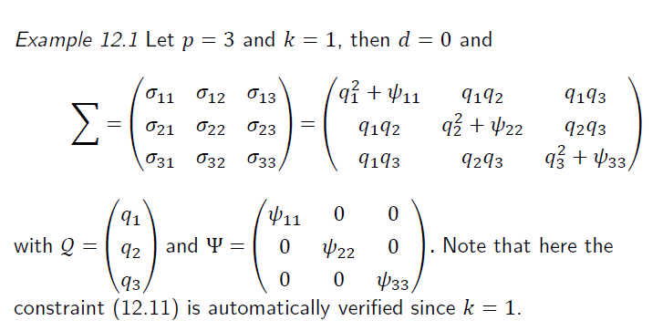
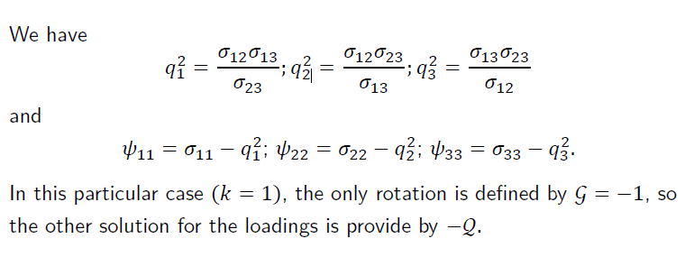
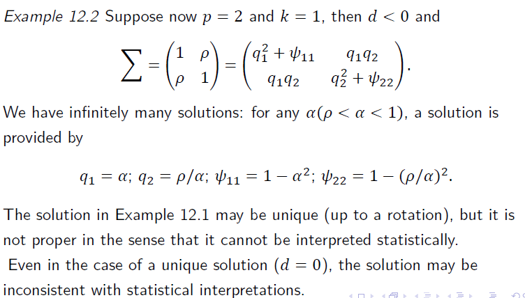
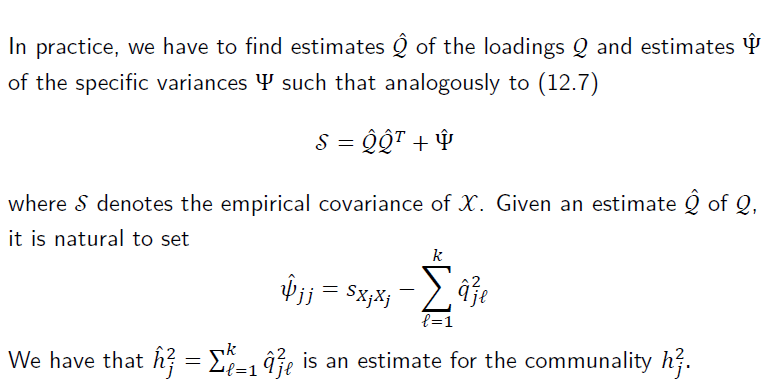
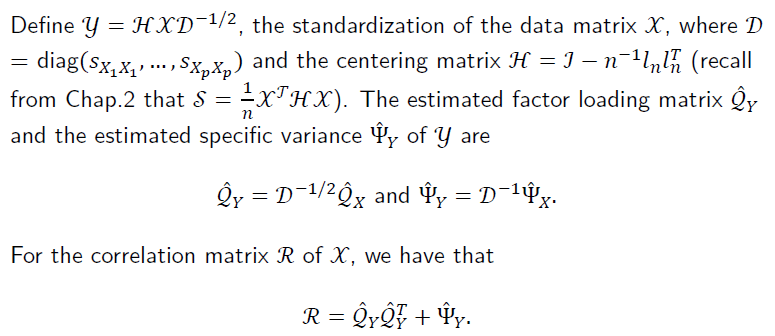
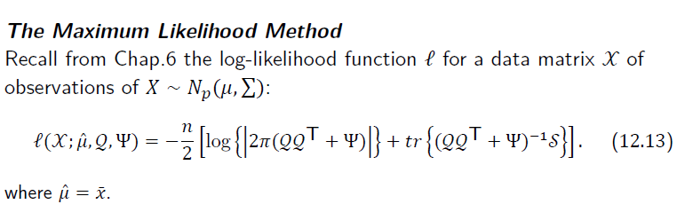
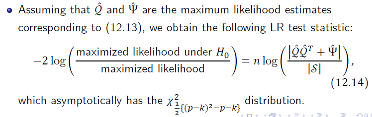
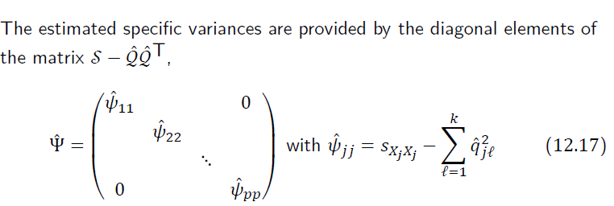
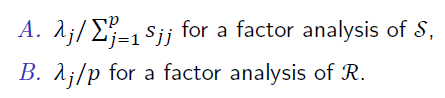

---
output:
  word_document: default
  html_document: default
---
#  因素分析 (Factor Analysis)

## 作用

因子分析主要是找出資料的結構，抑或是**潛藏因子（Latent factor）**，以少數幾個因素來解釋一群互相可能會有關係的變數，達到**降維**的效果，但是同時又不失去其他的訊息，使變數達到精簡。

## 理論模型

先從基本的來：
$$
\begin{gather*}
X = QF+\mu
\\\\
E(X) = \mu; \\
 QF = 0; \\ E(F) = 0;\\
 Var(F) = I_k
\\\\
Var(X) = \Sigma = \Gamma\Lambda\Gamma^{T} =\begin{pmatrix}\Gamma_1&\Gamma_2\end{pmatrix} \begin{pmatrix}\Lambda_1&0\\0&0\end{pmatrix}
\begin{pmatrix}\Gamma_1^T\\\Gamma_2^T\end{pmatrix} 
\end{gather*}
$$
$\lambda_{k+1} = \lambda_{k+2} = ... =\lambda_{p} = 0$，表示前面k個$\lambda$就已經包含所有的變異。

令

$$
\begin{gather*}
Y = \begin{pmatrix}Y_1\\Y_2\end{pmatrix} = \begin{pmatrix}\Gamma_1^T\\\Gamma_2^T\end{pmatrix} \begin{pmatrix}X-\mu\end{pmatrix} \sim (0, \begin{pmatrix}\Lambda_1&0\\0&0\end{pmatrix} )
\end{gather*}
$$

1. 沒有常態假設！！
2. $Y_2$服從期望值為0的退化分配， 就是說永遠都等於0
3. 矩陣相乘表示在eigenvectors 上的投影，Y 就是投影的新變數！
4. $F$ 為共同因素(Common Factor)，就是所有的變數會受到它影響。

$$
\begin{gather*}
\because 
\begin{pmatrix}\Gamma_1&\Gamma_2\end{pmatrix} 
\begin{pmatrix}\Gamma_1^T\\\Gamma_2^T\end{pmatrix}  = I_p\\
\\
\therefore \begin{pmatrix}\Gamma_1&\Gamma_2\end{pmatrix}  \begin{pmatrix}Y_1\\Y_2\end{pmatrix} = \begin{pmatrix}X-\mu\end{pmatrix} 
\\\\
X = \Gamma_1Y_1+\Gamma_2Y_2+\mu=\Gamma_1Y_1+\mu=(\Gamma_1\Lambda_1^{1/2})(\Lambda_1^{-1/2}Y_1)+\mu
\end{gather*}
$$
因此：                                                        
$$
Q = \Gamma_1\Lambda_1^{1/2}\ ; \ F = \Lambda_1^{-1/2}Y_1
$$

這表示$Q$包含了所有$X$的共同變異。

但是因子分析想要的更多，不只要共同的變異，也想要知道個別的變異，一般來說個別的變異會包含在殘差中（$\epsilon$），但是在因子分析中我們把它歸類成個別變異($U$)，就是自己獨有的變異，我們希望這個變異越少越好，不然很難做事啊！

$$
\begin{gather*}
X = QF+\mu+\epsilon = QF+\mu+U\\(U 為X自己的變異) 
\\
x_i = \sum_{l = 1}^k{q_{lj}f_l}+\mu_i+\epsilon_i
\end{gather*}
$$
該模型假設有：
- $E(F) = 0$
- $Var(F) = I_k$
- $E(U) = 0$
- $cov(U_i,U_j) = 0$
- $Var(U) = \Psi = \begin{pmatrix}\psi_{11}&0&...&0\\0&\psi_{22}&...&0\\...&...&...&...\\0&0&...&\psi_{pp}\end{pmatrix}$

若符合以上的假設，我們就將這個模型稱之為**Orthogonal Factor Model**。

```{r  echo=FALSE, fig.cap="A caption", out.width = '100%'}
knitr::include_graphics("fig/FA/Orthogonal Factor Model.PNG")
```
- $F$: 為共同因子 (Common Factor)，表示大家都有的因素

- $U$: 為特定因子 (Specific Factor)，表示只有自己有的因素。

- $Q$: 包含所有的變異，且為該$X_j$由各其他各潛藏因子(latent factors)組成的比重（loading），注意，這並不是唯一的，因為降維的關係所以通常可以旋轉，（例如一個平面降維到一條線，所以會有無限多條線，所以主要就是找到那個最好解釋的組合。）

其中，X自己的變異包含的共同因子變異$\sum_{l = 1}^k{q_{lj}^2}$與特定因子變異$\psi_{jj}$，前面那個是大家都有的，後面那個是只有自己有的。
所以：
$$
\sigma_{X_jX_j} = Var(X_j) = \sum_{l = 1}^k{q_{lj}^2}+\psi_{jj}
$$

令 $h_j^2 = \sum_{l=1}^2q_{jl}^2$，$h_{ij}^2$ 稱之為**communality**，而$\psi_{jj}$稱之為 **specific** **variance**。

### 向量們之間的關係

Variance 之間的關係

$$
\begin{gather*}
X = QF+\mu+\epsilon = QF+\mu+U  \\
\\
X-\mu = QF+U  
\\\\
\Sigma = E(X-\mu)(X-\mu)^T  \\
= E(QF+U)(QF+U)^T  \\
=QE(FF^T)Q^T+E(UU^T)  \ \   (\because Cov(F,U) = 0, By\  Model\ assumptions)\\
=QVar(F)Q^T+Var(U)
\\\\
\Rightarrow \Sigma = Var(X) =  QVar(F)Q^T+Var(U)
\\\\
\Rightarrow Var(X)-Var(U) =  QVar(F)Q^T\\\because Var(F) = I_k, \ \therefore Var(X)-Var(U) =  QQ^T\\
\end{gather*}
$$
$$
\begin{gather*}
\because X-\mu = QF+U
\\\\
\therefore \Sigma_{XF}=E[(QF+U)F^T]=E(QFF^T+UF^T) = QE(FF^T)+E(UF^T)\\
=QVar(F)+Cov(F,U)\\
and\\ Var(F)=I_k\ ;Cov(F,U) = 0
\\\\
\Rightarrow \Sigma_{XF} = Cov(X,F)=Q
\\\\
\Rightarrow Cor(X,F) = D^{-1/2}Q \qquad \\;\ D = diag(\sigma_{X_1X_1},\sigma_{X_2X_2}...\sigma_{X_pX_p})
\end{gather*}
$$
上面的結果表示，$Q$代表$X$與$F$ 之間的關係。

### 尺度影響

若
$$Y = CX$$
其中
$$
C = diag(c_1, c_2,..., c_p) \quad ; c_i 為常數，\forall i = 1,2,...p
$$
這表示$x_1$以$c_1$的倍放大（或縮小）
$$
\Rightarrow Var(Y) = C \Sigma C^T=C(QQ^T+\Psi)C^T = CQQ^TC^T+C \Psi C^T
$$
由上述的等式可看出，當資料的尺度放大（或縮小）時，loading ($Q$)也會跟著放大（或縮小）。

### Loading matrix 的旋轉

請注意，**Q 並非唯一！**
因為若
$$
G^{-1} = G^{T}\ \Rightarrow 
GG^T=I
$$
即 $G$ 為**Orthogonal Matrix**
則
$$
X = (QG)(G^TF)+U+\mu=Q^*F^*+U+\mu
$$
$G$在此為**旋轉矩陣**，即將$Q$旋轉但是不改變其本質，因為可以旋轉，所以$Q$並不唯一。

通常，我們會希望旋轉過後因子會有較大的變異（It makes sense to search for rotations that give factors that are maximally
correlated with various groups of variables），給$Q$一些限制，如：
$$
\begin{gather*}
Q^T\Psi^{-1}Q\ is \ diagonal\\
or\\
Q^TD^{-1}Q\ is \ diagonal
\\\;\ (D = diag(\sigma_{X_1X_1},\sigma_{X_2X_2}...\sigma_{X_pX_p}))
\end{gather*}
$$
該限制表示，$Q$除上$D$之後，任兩個culomns會垂直。

### 自由度

自由度 $d$：
$$
d = (\Sigma 原本的的參數數量)- (\Sigma 被限制的參數數量)
$$

各矩陣的自由度如下：

    矩陣             矩陣類型             自由度
---------------  -----------------  -----------------
$\Sigma$             對稱矩陣          1/2(p(p+1))
$Q$                 p $\times$ k      p $\times$ k
$\Psi$               對角矩陣              p
---------------  -----------------  -----------------
$Q、\Psi$這兩個為限制，且因為上面的限制($Q^T\Psi^{-1}Q$ 為對角矩陣)，所以限制的參數數量會減少1/2(k(k+1))

最終自由度$d$為：

$$
\begin{gather*}
d = (\Sigma 原本的的參數數量)- (\Sigma 被限制的參數數量)\\
=\frac{1}{2}(p(p-1))-(p+p*k-\frac{1}{2}(k(k-1)))\\
=\frac{1}{2}(p-k)^2-\frac{1}{2}(p+k)
\end{gather*}
$$
$d$會有以下三種情況

- $d<0$:
有無限多組解，亦即有很多的Q可以讓大家選，通常會出現這個情況是因為k太大，也就是想要的潛藏因子太多太貪心。

- $d = 0$:
有唯一解，就是幸福(其實也不一定啦，但是方便很多。)

- $d >0$:
並不存在確切的解，實證資料通常會遇到這樣的情情。

舉例：

```{r}
DF <- function(p,k){
  d = ((p-k)^2-(p+k))/2
  return(d)
}
 DF(6,1); DF(6,2); DF(6,3); DF(6,4); DF(6,5); DF(6,6)
```

另一組資料有6個變數(X1到X6)：

潛藏因子數     d          解
-----------  -----   -------------
1             9        無限多組解
2             4        無限多組解
3             0        唯一解
4             -3       無解
5             -5       無解
6             -6       無解
-----------  -----   -------------


#### 例子

- Example 01:
```{r  echo=FALSE, fig.cap="Ex01.1", out.width = '100%'}

```

```{r  echo=FALSE, fig.cap="Ex 01.2", out.width = '100%'}

```

**其中，實證資料中，$\psi_{jj}$可能會小於零，通常就直接將它視為0。**

- Example 02: 
```{r  echo=FALSE, fig.cap="Ex02.1", out.width = '100%'}

```

```{r  echo=FALSE, fig.cap="Ex 02.2", out.width = '100%'}

```
```{r  echo=FALSE, fig.cap="Ex 02.3", out.width = '100%'}

```

### 標準化

將資料標主化，令：
$$
Y = HXD^{-1/2}
$$
- $H$: Centering Matrix，$H = I_n-\frac{1}{n}11^T$  
- $D = diag(S_{X_1X_1},S_{X_2X_2},...,S_{X_pX_p} )$  

其中，
$$
\hat{Q}_Y = D^{-1/2}\hat{Q}_X \ ;\ \hat{\Psi}_Y = D^{-1}\hat{\Psi}_X
$$

此外，Correlation Matrix 為：

$$
R = \hat{Q}_Y\hat{Q}^T_Y+\hat{\Psi}_Y
$$

### 估計

$$
\begin{gather*}
\Sigma = Var(X) =  QVar(F)Q^T+Var(U) = QQ^T+\Psi\\\\
\Rightarrow \hat{\Sigma} = S =  \hat{Q}\hat{Q^T}+\hat{\Psi}
\end{gather*}
$$
拆解之後可以得到：
$$
\begin{gather*}
\hat{\Psi}_{jj}=S_{X_jX_j}-\sum_{l=1}^k\hat{q}_{jl}^2
\end{gather*}
$$

表示$X_j$的自己才擁有的變異是由$X_j$的變異($S_{X_jX_j}$)再減去所有潛在因子可解釋的變異($\sum_{l=1}^k\hat{q}_{jl}^2$)

其中，我們把所有潛藏因子可解釋的變異稱為共同性(communality)：
$$
\begin{gather*}
h_j^2=\sum_{l=1}^kq_{jl}^2\\
\Rightarrow \hat{h}_j^2=\sum_{l=1}^k\hat{q}_{jl}^2
\end{gather*}
$$

### 估計方式

找出$\hat{Q}$、$\Psi$與$\hat{\mu}$的方式有3種，分別為**最大概似估計法(The Maximum Likelihood Method, MLM)**、**PCM(The principal Component Method)**以及**MPF(The Method of Principal Factors)**，其中較常被使用的為前方兩種，。

- **MLM**

其中，和簡單回歸一樣，使用MLM的方法$X$需要常態假設$X \sim N_p(\mu, \Sigma)$，因為有這樣的限制，所以$X$的分配就不可以太奇怪，通常只要資料不要漲得太奇怪(例如極致厚尾或是雙峰)，就可以使用啦~

**注意: Orthogonal Factor Model 不用常態假設喔！** 

Likehood function:
```{r  echo=FALSE, fig.cap="Ex01.1", out.width = '100%'}

```

其中$\hat{\mu}$藏在$S$裡面。

另外的想法是，將損失函數(Loss function)定義為上方 Likehood function 的樣子也可以，而且這樣就不用常態假設，不過後續推導要小心，不可以擅自將X加入常態的性質。

**MLM的檢定**
若$\hat{Q}、\hat{\Psi}$為MLE估計量，可以進行以下的檢定：

假設：

$$
H_0: factor\ analysis\;  v.s\ H_1: no \ constraints\ on\ covariance\ matrix
$$
統計量：

```{r  echo=FALSE, fig.cap="Ex01.1", out.width = '100%'}

```

我們是希望不拒絕虛無假設，表示可以進行 factor analysis。

Bartlett 於 1954 發表的新的統計量，表示該統計量可以更快的收斂至該卡方分配。
```{r  echo=FALSE, fig.cap="Ex01.1", out.width = '100%'}
knitr::include_graphics("fig/FA/Likelihood Ratio Test.02.PNG")
```


- **PCM**

這個方始會先找出$\hat{Q}$，其中
$$
\begin{gather*}
S = \Gamma \Lambda \Gamma^T
\\
\hat{Q} = (\sqrt{\lambda_1}\gamma_1,\sqrt{\lambda_2}\gamma_2,...,\sqrt{\lambda_k}\gamma_k, )
\end{gather*}
$$
接著
```{r  echo=FALSE, fig.cap="Ex01.1", out.width = '100%'}

```

其中，

```{r  echo=FALSE, fig.cap="Ex01.1", out.width = '100%'}

```
- 


參考資料：http://sfb649.wiwi.hu-berlin.de/fedc_homepage/xplore/tutorials/mvahtmlnode73.html

## R 實作

### 資料介紹

```{r data set, include=F, echo=F, warning=F, message=F}
library(tidyverse)
rm(list = ls())
data = read.table("course materials\\all_R_code\\MVA-master\\QID-1211-MVAfacthous\\bostonh.dat")
head(data)
```

- $X_1$: 首都犯罪率。(per capita crime rate)
- $X_2$: proportion of residential land zoned for large lots,
- $X_3$: proportion of nonretail business acres,
- $X_4$: 是否鄰近查爾斯河(Charles River) (是:1；否:0)(1 if tract bounds river, 0 otherwise),
- $X_5$: nitric oxides concentration,
- $X_6$: average number of rooms per dwelling,
- $X_7$: proportion of owner-occupied units built prior to 1940,
- $X_8$: weighted distances to five Boston employment centers,
- $X_9$: index of accessibility to radial highways,
- $X_{10}$: full-value property tax rate per $10,000,
- $X_{11}$: pupil/teacher ratio,
- $X_{12}$: 1000(B − 0.63)2I(B < 0.63) where B is the proportion of African American,
- $X_{13}$: % lower status of the population,
- $X_{14}$: median value of owner-occupied homes in $1000.

### MLM 估計法(Maximum Likelihood Factor Analysis)

#### 資料轉換
```{r transform data}
xt = data
xt[, 1]  = log(data[, 1])
xt[, 2]  = data[, 2]/10
xt[, 3]  = log(data[, 3])
xt[, 5]  = log(data[, 5])
xt[, 6]  = log(data[, 6])
xt[, 7]  = (data[, 7]^(2.5))/10000
xt[, 8]  = log(data[, 8])
xt[, 9]  = log(data[, 9])
xt[, 10] = log(data[, 10])
xt[, 11] = exp(0.4 * data[, 11])/1000
xt[, 12] = data[, 12]/100
xt[, 13] = sqrt(data[, 13])
xt[, 14] = log(data[, 14])
data = xt[, -4] # 去除01變數
colnames(data) = c("X1", "X2", "X3", "X5", "X6", "X7", "X8", "X9", "X10", "X11", "X12", 
    "X13", "X14") # rename variables
```

```{r standardize variables and correlation matrix}
da  = scale(data) # standardize variables
dat = cor(da)     # correlation matrix
```

#### 開始估計

without varimax rotation factanal performs

```{r without varimax rotation}
mlm  = factanal(da, 3, rotation = "none", covmat = dat) # 3個潛在因子
load = mlm$loadings                           # estimated factor loadings
ld   = cbind(load[, 1], load[, 2], load[, 3]) # the estimated factor loadings matrix
com  = diag(ld %*% t(ld))                     # communalities are calculated
psi  = diag(dat) - diag(ld %*% t(ld))         # 特定因子估計(specific variances are calculated)
tbl  = cbind(load[, 1], load[, 2], load[, 3], com, psi)
```

```{r Plot Factor, message=F, warning=F}

load <- mlm$loadings[,1:3] %>% as.data.frame() %>% tibble::add_column(X = c(1:3, 5:14), .before = 1)

library(ggrepel) # geom_text_repel

PlotFactor <- function(i,j){
  ggplot(data = load)+
    geom_point(mapping = aes(x = load[,i+1], y = load[,j+1]))+
    geom_text_repel(aes(x = load[,i+1], y = load[,j+1],label = X), size = 4)+
    geom_hline(aes(yintercept=0), colour="#990000", linetype="dashed")+
  geom_vline(aes(xintercept=0), colour="#990000", linetype="dashed")+
    labs(title = stringr::str_interp("Factors${j}${i}- theta${j}${i}"),
         x = stringr::str_interp("Factor${i}"),
         y = stringr::str_interp("Factor${j}"))
}
gridExtra::grid.arrange(
PlotFactor(1,2), # plot first factor against second
PlotFactor(1,3), # plot first factor against third
PlotFactor(2,3), ncol = 2) # plot second factor against third
```


# 轉轉轉

將矩陣旋轉到變異數較大的地方

```{r MLM after varimax rotation}
var  = varimax(ld)                            # rotates the factor loadings matrix
load = var$loadings  # estimated factor loadings after varimax
vl   = cbind(load[, 1], load[, 2], load[, 3])
com  = diag(vl %*% t(vl))                     # communalities are calculated
psi  = diag(dat) - diag(vl %*% t(vl))         # specific variances are calculated
tbl  = cbind(load[, 1], load[, 2], load[, 3], com, psi)
```
```{r Plot Factor.2, message=F, warning=F}

load <- load[,1:3] %>% as.data.frame() %>% tibble::add_column(X = c(1:3, 5:14), .before = 1)

library(ggrepel) # geom_text_repel

gridExtra::grid.arrange(
PlotFactor(1,2), # plot first factor against second
PlotFactor(1,3), # plot first factor against third
PlotFactor(2,3), ncol = 2) # plot second factor against third
```
**通常會將變項轉到對角向量**

### PCM 估計
**Principal Component Method** after varimax rotation spectral decomposition

```{r}
e      = eigen(dat)
eigval = e$values[1:3]
eigvec = e$vectors[, 1:3]
E      = matrix(eigval, nrow(dat), ncol = 3, byrow = T)
Q      = sqrt(E) * eigvec                     # the estimated factor loadings matrix
pcm    = varimax(Q)                           # rotates the factor loadings matrix
load   = pcm$loadings                         # estimated factor loadings after varimax
ld     = cbind(load[, 1], load[, 2], load[, 3])
com    = diag(ld %*% t(ld))                   # communalities are calculated
psi    = diag(dat) - diag(ld %*% t(ld))       # specific variances are calculated
tbl    = cbind(load[, 1], load[, 2], load[, 3], com, psi)

```


```{r Plot Factor.3, message=F, warning=F}

load <- ld %>% as.data.frame() %>% tibble::add_column(X = c(1:3, 5:14), .before = 1)

library(ggrepel) # geom_text_repel

gridExtra::grid.arrange(
PlotFactor(1,2), # plot first factor against second
PlotFactor(1,3), # plot first factor against third
PlotFactor(2,3), ncol = 2) # plot second factor against third
```

```{r}
f      = solve(dat)
psiini = diag(1/f[row(f) == col(f)]) # preliminary estimate of psi
psi    = psiini
for (i in 1:10) {
    ee     = eigen(dat - psi)
    eigval = ee$values[1:3]
    eigvec = ee$vectors[, 1:3]
    EE     = matrix(eigval, nrow(dat), ncol = 3, byrow = T)
    QQ     = sqrt(EE) * eigvec
    psiold = psi
    psi    = diag(as.vector(1 - t(colSums(t(QQ * QQ)))))
    i      = i + 1
    z      = psi - psiold
    convergence = z[row(z) == col(z)]
}
pfm  = varimax(QQ)                             # rotates the factor loadings matrix
load = pfm$loadings                            # estimated factor loadings after varimax
ld   = cbind(load[, 1], load[, 2], load[, 3])
com  = diag(ld %*% t(ld))                      # communalities are calculated
psi  = diag(dat) - diag(ld %*% t(ld))          # specific variances are calculated
tbl  = cbind(load[, 1], load[, 2], load[, 3], com, psi)

dev.new()
par(mfcol = c(2, 2))

```

```{r Plot Factor.4}
```
