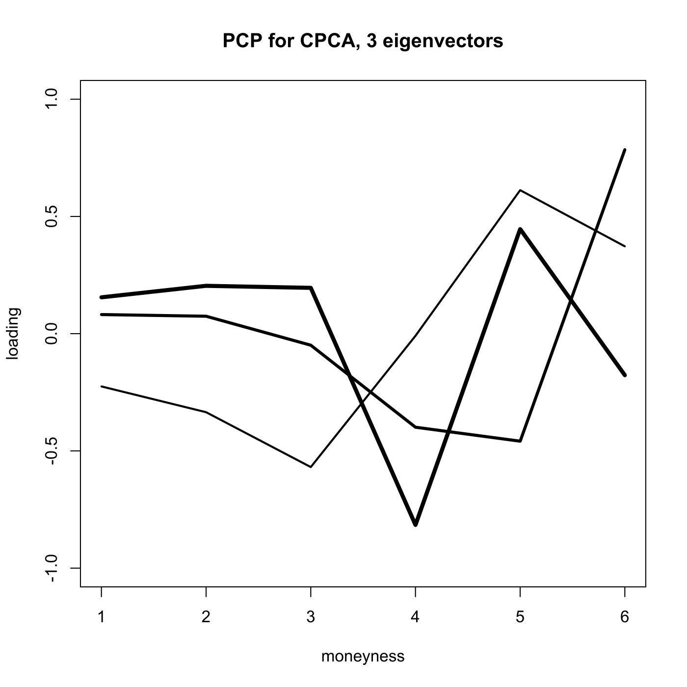

[](http://quantlet.de/)

## [](http://quantlet.de/) **MVAcpcaiv** [](http://quantlet.de/)

```yaml

Name of QuantLet : MVAcpcaiv

Published in : Applied Multivariate Statistical Analysis

Description : 'Estimates a common principal components model for the implied volatility data and
computes a likelihood ratio test.'

Keywords : 'principal-components, pca, eigenvalues, plot, graphical representation, data
visualization, common-principal-component, cpc, volatility, implied-volatility,
likelihood-ratio-test'

See also : 'MVAnpcabanki, MVAnpcabank, MVAnpcahousi,, MVAnpcatime, MVAnpcafood, MVAnpcausco,
MVAnpcausco2, MVAnpcausco2i, MVApcabank, MVAnpcahous, MVApcabanki, MVApcabankr, MVApcasimu'

Author : Zografia Anastasiadou, Awdesch Melzer

Submitted : Wed, June 04 2014 by Felix Jung

Datafile : XFGvolsurf01.dat, XFGvolsurf02.dat, XFGvolsurf03.dat

Example : Factor loadings of the first (thick), the second (medium) and the third (thin) PC.

```




### R Code:
```r

# clear all variables
rm(list = ls(all = TRUE))
graphics.off()

# install and load packages
libraries = c("gRapHD")
lapply(libraries, function(x) if (!(x %in% installed.packages())) {
    install.packages(x)
})
lapply(libraries, library, quietly = TRUE, character.only = TRUE)

# load data
data1 = read.table("XFGvolsurf01.dat")  # 1 month maturity data
data2 = read.table("XFGvolsurf02.dat")  # 2 months maturity data
data3 = read.table("XFGvolsurf03.dat")  # 3 months maturity data

S1 = cov(data1) * 1e+05  # Sample covariance*10^5 of 1 month maturity data
S2 = cov(data2) * 1e+05  # Sample covariance*10^5 of 2 months maturity data
S3 = cov(data3) * 1e+05  # Sample covariance*10^5 of 3 months maturity data

S = rbind(S1, S2, S3)    # Combine data by rows
A = array(t(S), c(ncol(S1), ncol(S2), 3))  # Create a 3d array
n = c(253, 253, 253)     # Number of trading days in 1999
N = n - 1

preB    = 1e-10          # Precision for maximum deviation of an element of matrix B
maxit   = 15             # Maximal number of iteration
preQ    = 1e-10          # Precision for maximum deviation of an element of matrix Q
maxiter = 10             # Maximal number of iteration
p       = dim(A)[1]      # Covariances are pxp
k       = dim(A)[3]      # Number of groups
B       = diag(p)        # Initial value for B, the unit matrix
f = 0

repeat {
    f = f + 1
    Bold = B
    j = 1
    while (j <= p) {
        m = 1
        while (m < j) {
            Bmj = cbind(B[, m], B[, j])
            (T = array(0, c(2, 2, k)))
            T[, , 1] = t(Bmj) %*% A[, , 1] %*% Bmj
            T[, , 2] = t(Bmj) %*% A[, , 2] %*% Bmj
            T[, , 3] = t(Bmj) %*% A[, , 3] %*% Bmj
            Q = cbind(c(1, 0), c(0, 1))  # orthogonal matrix to start with
            g = 0
            repeat {
                g = g + 1
                Qold = Q
                Delta1 = array(Q, c(2, 2, k)) * T * (array(Q, c(2, 2, k)))
                diag(Delta1[, , 1])
                Delta = array(c(diag(Delta1[, , 1])), c(2, 1, 3))
                Delta[, , 1] = c(diag(Delta1[, , 1]))
                Delta[, , 2] = c(diag(Delta1[, , 2]))
                Delta[, , 3] = c(diag(Delta1[, , 3]))
                a = t(Delta[, , 1])
                b = t(Delta[, , 2])
                c = t(Delta[, , 3])
                abc = matrix(cbind(a, b, c), 2, 3)
                abcd = t(abc)
                d = N * (abcd[, 1] - abcd[, 2])/(abcd[, 1] * abcd[, 2])
                Tsum1 = array(0, c(2, 2, k))
                Tsum1[, , 1] = d[1] * T[, , 1]
                Tsum1[, , 2] = d[2] * T[, , 2]
                Tsum1[, , 3] = d[3] * T[, , 3]
                f = sum(Tsum1[, 1, ][1, ])
                g = sum(Tsum1[, 1, ][2, ])
                h = sum(Tsum1[, 2, ][1, ])
                y = sum(Tsum1[, 2, ][2, ])
                Tsum = matrix(rbind(f, g, h, y), 2, 2)
                e = eigen(Tsum)
                Q = e$vectors  # find eigenvectors of Tsum
                maxim = max(abs(Q - Qold))
                if ((maxim < preQ) | (g > maxiter)) 
                  break
            }
            J = diag(p)
            J[m, m] = Q[1, 1]
            J[m, j] = Q[1, 2]
            J[j, m] = Q[2, 1]
            J[j, j] = Q[2, 2]
            B = B %*% J
            m = m + 1
            print(m)
        }
        j = j + 1
    }
    maximum = max(abs(B - Bold))
    if ((maximum < preB) | (f > maxit)) 
        break
}

lambda1 = array(t(B), c(p, p, k)) * A * (array(B, c(p, p, k)))
lambda  = array(c(diag(lambda1[, , 1])), c(p, 1, 3))
lambda[, , 1] = c(diag(lambda1[, , 1]))
lambda[, , 2] = c(diag(lambda1[, , 2]))
lambda[, , 3] = c(diag(lambda1[, , 3]))
a1b1c1 = matrix(cbind(t(lambda[, , 1]), t(lambda[, , 2]), t(lambda[, , 3])), p, k)

# Sort eigenvectors according to size of its corresponding eigenvalues
u   = rbind(t(a1b1c1), B)
us  = t(u)
us  = us[order(us[, 1]), ]
uss = us[p:1, ]
B   = t(uss[, (k + 1):(k + p)])
BB  = t(B[, 1:k])

# plot
plot(BB[1, ], type = "l", lwd = 4, ylim = c(-1, 1), xlab = "moneyness", ylab = "loading", 
    main = "PCP for CPCA, 3 eigenvectors")
lines(BB[2, ], type = "l", lwd = 3)
lines(BB[3, ], type = "l", lwd = 2)

# estimated population covariances
V          = array(0, c(p, p, k))
V[, , 1]   = uss[, 1] * diag(p)
V[, , 2]   = uss[, 2] * diag(p)
V[, , 3]   = uss[, 3] * diag(p)
psi = array(0, c(p, p, k))
psi[, , 1] = B %*% V[, , 1] %*% t(B)
psi[, , 2] = B %*% V[, , 2] %*% t(B)
psi[, , 3] = B %*% V[, , 3] %*% t(B)

# Test statistic
de   = c(det(psi[, , 1]), det(psi[, , 2]), det(psi[, , 3]))
det  = c(det(A[, , 1]), det(A[, , 2]), det(A[, , 3]))
test = 2 * log(t(n - 1) %*% (de/det))

# P-value
df = 1/2 * (k - 1) * p * (p - 1)
t  = 1 - pchisq(test, df) 

```
