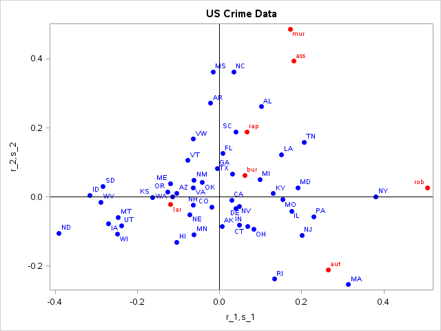

[](http://quantlet.de/)

## [](http://quantlet.de/) **MVAcorrcrime** [](http://quantlet.de/)

```yaml

Name of QuantLet : MVAcorrcrime

Published in : Applied Multivariate Statistical Analysis

Description : 'Performs a correspondence analysis for the US crime, shows the eigenvalues of the
singular value decomposition of the chi-matrix and displays graphically its factorial
decomposition.'

Keywords : 'correspondence-analysis, svd, decomposition, factorial-decomposition, eigenvalues,
factorial, plot, graphical representation, data visualization, sas'

See also : 'MVAcorrCar, MVAcorrEyeHair, MVAcorrjourn, MVAcorrbac, SMScorrcrime, SMScorrcarm,
SMScorrfood, SMScorrhealth'

Author : Zografia Anastasiadou

Author[SAS] : Svetlana Bykovskaya

Submitted : Tue, May 10 2011 by Zografia Anastasiadou

Submitted[SAS] : Tue, April 5 2016 by Svetlana Bykovskaya

Datafile : uscrime.dat, uscrime_sas.dat

```




### R Code:
```r

# clear all variables
rm(list = ls(all = TRUE))
graphics.off()

# load data
x1 = read.table("uscrime.dat")
x  = x1[, 3:9]
a  = rowSums(x)
b  = colSums(x)
e  = matrix(a) %*% b/sum(a)

# chi-matrix
cc = (x - e)/sqrt(e)

# singular value decomposition
sv = svd(cc)
g  = sv$u
l  = sv$d
d  = sv$v

# eigenvalues
ll = l * l

# cumulated percentage of the variance
aux  = cumsum(ll)/sum(ll)
perc = cbind(ll, aux)

r1   = matrix(l, nrow = nrow(g), ncol = ncol(g), byrow = T) * g
r    = r1/matrix(sqrt(a), nrow = nrow(g), ncol = ncol(g), byrow = F)
s1   = matrix(l, nrow = nrow(d), ncol = ncol(d), byrow = T) * d
s    = s1/matrix(sqrt(b), nrow = nrow(d), ncol = ncol(d), byrow = F)

rr   = r[, 1:2]
ss   = s[, 1:2]

# labels for crimes
crime = c("mur", "rap", "rob", "ass", "bur", "lar", "aut")

# labels for regions
state = c("ME", "NH", "VT", "MA", "RI", "CT", "NY", "NJ", "PA", "OH", "IN", "IL", 
    "MI", "WI", "MN", "IA", "MO", "ND", "SD", "NE", "KS", "DE", "MD", "VA", "VW", 
    "NC", "SC", "GA", "FL", "KY", "TN", "AL", "MS", "AR", "LA", "OK", "TX", "MT", 
    "ID", "WY", "CO", "NM", "AZ", "UT", "NV", "WA", "OR", "CA", "AK", "HI")

# plot
plot(rr, type = "n", xlim = c(-0.4, 0.6), ylim = c(-0.3, 0.5), xlab = "r_1,s_1", 
    ylab = "r_2,s_2", main = "US Crime Data", cex.axis = 1.2, cex.lab = 1.2, cex.main = 1.6)
points(ss, type = "n")
text(rr, state, cex = 1.2, col = "blue")
text(ss, crime, col = "red")
abline(h = 0, v = 0, lwd = 2)

```

### SAS Code:
```sas

* Import the data;
data uscrime;
  infile '/folders/myfolders/data/uscrime_sas.dat';
  input temp1-temp11;
run;

proc iml;
  * Read data into a matrix;
  use uscrime;
    read all var _ALL_ into x; 
  close uscrime;
  
  x = x[, 3:9];
  a = x[,+];
  b = x[+,];
  e = a * b / sum(a);
  
  * chi-matrix;
  cc = (x - e)/sqrt(e);
  
  * singular value decomposition;
  call svd(u,q,v,cc);
  
  * eigenvalues;
  qq = q # q;
  
  * cumulated percentage of the variance;
  aux  = cusum(qq)/sum(qq);
  perc = qq || aux;
  r1   = repeat(q`, nrow(u), 1) # u;
  r    = r1 / repeat(sqrt(a), 1, ncol(u));
  s1   = repeat(q`, nrow(v), 1) # v;
  s    = s1 / repeat(sqrt(b)`, 1, ncol(v));
  
  * contribution in r;
  car = repeat(a, 1, ncol(r)) # (r ## 2) / repeat((q ## 2)`, nrow(r), 1);
  
  * contribution in s;
  cas = repeat(b`, 1, ncol(s)) # (s ## 2) / repeat((q ## 2)`, nrow(s), 1);
  
  rr = r[, 1:2];
  ss = s[, 1:2];
  
  crime = {"mur", "rap", "rob", "ass", "bur", "lar", "aut"};                       * labels for crimes;
  state = {"ME", "NH", "VT", "MA", "RI", "CT", "NY", "NJ", "PA", "OH", "IN", "IL", 
    "MI", "WI", "MN", "IA", "MO", "ND", "SD", "NE", "KS", "DE", "MD", "VA", "VW", 
    "NC", "SC", "GA", "FL", "KY", "TN", "AL", "MS", "AR", "LA", "OK", "TX", "MT", 
    "ID", "WY", "CO", "NM", "AZ", "UT", "NV", "WA", "OR", "CA", "AK", "HI"};       * labels for regions;
  
  x1  = rr[,1];
  x2  = rr[,2]; 
  x3  = ss[,1];
  x4  = ss[,2]; 
      
  create plot var {"x1" "x2" "x3" "x4" "crime" "state"};
    append;
  close plot;
quit;

proc sgplot data = plot
    noautolegend;
  title 'US Crime Data';
  scatter x = x1 y = x2 / markerattrs = (color = blue symbol = circlefilled)
    datalabel = state;
  scatter x = x3 y = x4 / markerattrs = (color = red symbol = circlefilled)
    datalabel = crime;
  refline 0 / lineattrs = (color = black);
  refline 0 / axis = x lineattrs = (color = black);
  xaxis label = 'r_1,s_1';
  yaxis label = 'r_2,s_2';
run;
```
