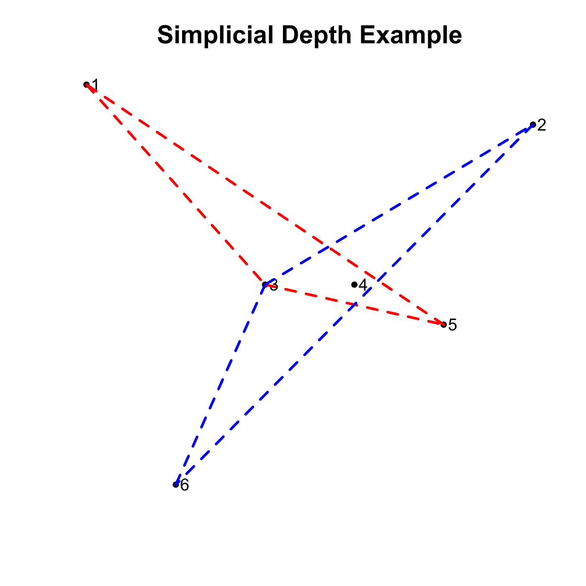

[](http://quantlet.de/)

## [](http://quantlet.de/) **MVAsimdep1** [](http://quantlet.de/)

```yaml

Name of QuantLet : MVAsimdep1

Published in : Applied Multivariate Statistical Analysis

Description : Shows an example for the simplicial depth in 2 dimensions.

Keywords : simplicial-depth, plot, graphical representation

See also : MVAppsib, MVAsimdepex, MVAsir2data, MVAsirdata, MVAppexample, ppsib, ppsibexample

Author : Zografia Anastasiadou

Submitted : Tue, December 17 2013 by Franziska Schulz

```




### R Code:
```r

# clear all variables
rm(list = ls(all = TRUE))
graphics.off()

t   = c(1:6)
a   = c(10, 0, 5, 5, 4, 9)
x1  = cbind(t, a)

plot(x1, main = "Simplicial Depth Example", cex.main = 1.8, pch = 16, axes = FALSE, 
    xlab = "", ylab = "")
text(x1[1, 1] + 0.1, x1[1, 2], "1", cex = 1.2)
text(x1[2, 1] + 0.1, x1[2, 2], "6", cex = 1.2)
text(x1[3, 1] + 0.1, x1[3, 2], "3", cex = 1.2)
text(x1[4, 1] + 0.1, x1[4, 2], "4", cex = 1.2)
text(x1[5, 1] + 0.1, x1[5, 2], "5", cex = 1.2)
text(x1[6, 1] + 0.1, x1[6, 2], "2", cex = 1.2)

# Draw line segments between pairs of points
segments(x1[1, 1], x1[1, 2], x1[3, 1], x1[3, 2], col = "red", lty = 2, lwd = 3)
segments(x1[3, 1], x1[3, 2], x1[5, 1], x1[5, 2], col = "red", lty = 2, lwd = 3)
segments(x1[5, 1], x1[5, 2], x1[1, 1], x1[1, 2], col = "red", lty = 2, lwd = 3)
segments(x1[2, 1], x1[2, 2], x1[3, 1], x1[3, 2], col = "blue", lty = 2, lwd = 3)
segments(x1[3, 1], x1[3, 2], x1[6, 1], x1[6, 2], col = "blue", lty = 2, lwd = 3)
segments(x1[6, 1], x1[6, 2], x1[2, 1], x1[2, 2], col = "blue", lty = 2, lwd = 3) 

```
