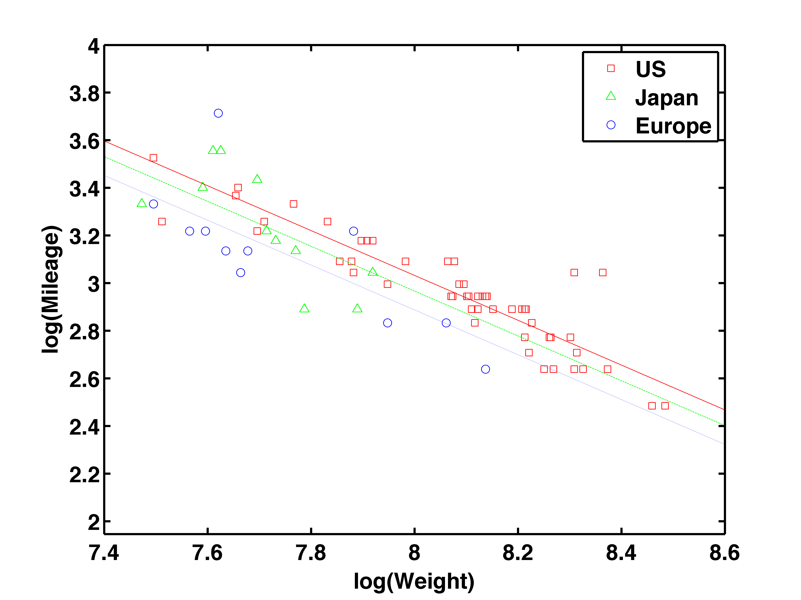

[](http://quantlet.de/)

## [](http://quantlet.de/) **MVAcareffect** [](http://quantlet.de/)

```yaml

Name of QuantLet : MVAcareffect

Published in : Applied Multivariate Statistical Analysis

Description : Computes a linear regression of mileage on weight and displacement for car data set

Keywords : 'linear model, linear regression, least squares, R-squared, summary, F test,
F-statistic, F-test, lm'

Author : Zdenek Hlavka

Author[Matlab] : Janek Berger

Submitted : Wed, June 07 2017 by Petra Burdejova

Datafile[R] : carc.rda

Datafile[Matlab] : carc.txt

```





### MATLAB Code:
```matlab
% Clear workspace
clear all
close all
clc

% Add path where your files are located
% addpath C:\Users\
% addpath /Users/

% Load data set
load carc.txt;
cardata = carc;
% ----------------------------------------------------------------------
% Define variables

mileage = cardata(:,2);
weight = cardata(:,8);
displacement = cardata(:,11);
origin = cardata(:,13);
price = cardata(:,1);

% ----------------------------------------------------------------------
% Descriptive plots I

figure(1)
s1 = subplot(2, 2, 1)
scatter(log(weight), log(mileage), 'k')
box on
xlabel('log(Weight)')
ylabel('log(Mileage)')

s2 = subplot(2, 2, 2)
scatter(log(displacement), log(mileage), 'k')
box on
xlabel('log(Displacement)')
ylabel('log(Mileage)')

s3 = subplot(2, 2, 3)
boxplot(log(mileage), origin, 'labels', {'US';'Japan';'Europe'})
box on
xlabel('Origin')
ylabel('log(Mileage)')

s4 = subplot(2, 2, 4)
scatter(log(weight), log(displacement), 'k')
box on
xlabel('log(Weight)')
ylabel('log(Displacement)')


% print -painters -dpdf -r600 SMSlinregcar01.pdf
% print -painters -dpng -r600 SMSlinregcar01.png
% ----------------------------------------------------------------------
% Plot of regression lines with group-specific means

[h, a, c, s] = aoctool(log(weight), log(mileage), origin, 0.05, '', '', '', 'off', 'parallel lines')
slope = cell2mat(c(6, 2));


figure(2)
plot(log(weight(find(origin==1))),log(mileage(find(origin==1))),'sr')
hold on
plot(log(weight(find(origin==2))),log(mileage(find(origin==2))),'^g')
plot(log(weight(find(origin==3))),log(mileage(find(origin==3))),'ob')
box on
us_line = refline(slope, s.intercepts(1));
ja_line = refline(slope, s.intercepts(2));
eu_line = refline(slope, s.intercepts(3));

set(us_line,'LineStyle','-', 'Color','r')
set(ja_line,'LineStyle','--','Color','g')
set(eu_line,'LineStyle',':','Color','b')
legend('US','Japan','Europe')
xlabel('log(Weight)','FontSize',16,'FontWeight','Bold')
ylabel('log(Mileage)','FontSize',16,'FontWeight','Bold')
set(gca,'LineWidth',1.6,'FontSize',16,'FontWeight','Bold')
xlim([7.4 8.6])
hold off
% print -painters -dpdf -r600 SMSlinregcar02.pdf
% print -painters -dpng -r600 SMSlinregcar02.png

```

### R Code:
```r

# clear variables and close windows
rm(list=ls(all=TRUE))
graphics.off()

# load data
load("carc.rda")

carc=carc[,c("M","W","D","C","P")]
names(carc)=c("Mileage","Weight","Displacement","Origin","Price")

attach(carc)
opar=par(mfrow=c(2,2))
plot(log(Mileage)~log(Weight))
plot(log(Mileage)~log(Displacement))
plot(log(Mileage)~Origin)
plot(log(Displacement)~log(Weight))

# reasonable model
summary(lm1<-lm(log(Mileage)~log(Weight)+log(Displacement)+Origin))
# model without origin
lm2<-lm(log(Mileage)~log(Weight)+log(Displacement))
# test whether origin is significant
anova(lm1,lm2)

dev.new()
plot(lm1)

summary(lm3<-lm(log(Mileage)~log(Weight)+Origin))

dev.new()
par(mfrow=c(1,1))
plot(log(Mileage)~log(Weight),pch=as.numeric(Origin)-(Origin=="US")-2*(Origin=="Europe"),col=as.numeric(Origin)+1)
oo=order(carc$Weight)
c3=coef(lm3)
abline(c(c3[1],c3[2]),col=2) # US
abline(c(c3[1]+c3[3],c3[2]),col=3,lty=2) # Japan
abline(c(c3[1]+c3[4],c3[2]),col=4,lty=3) # Europe

par(opar)
detach(carc)

```
