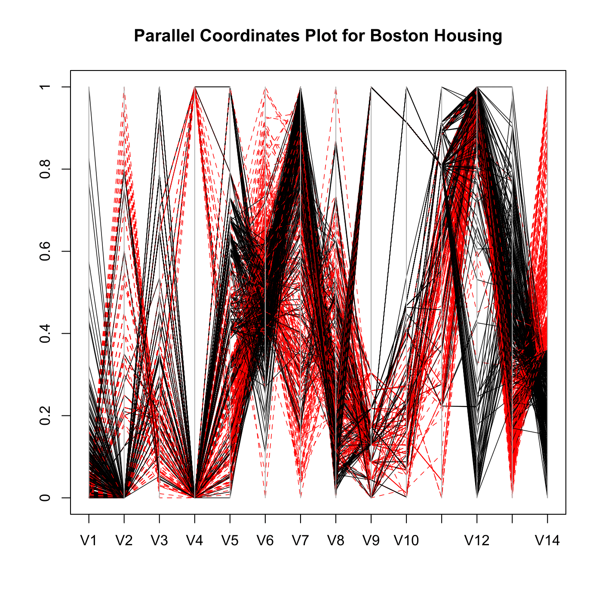

[](http://quantlet.de/)

## [](http://quantlet.de/) **MVApcphousing** [](http://quantlet.de/)

```yaml

Name of QuantLet : MVApcphousing

Published in : Applied Multivariate Statistical Analysis

Description : Computes Parallel Coordinates Plot (PCP) for Boston Housing data.

Keywords : 'pcp, parallel-coordinates-plot, financial, data visualization, plot, graphical
representation'

See also : 'MVAdrafthousing, MVAdrafthousingt, MVApcp1, MVApcp2, MVApcp3, MVApcp4, MVApcp5,
MVApcp6, MVApcp7, MVApcp8'

Author : Vladimir Georgescu, Jorge Patron, Song Song, Awdesch Melzer

Submitted : Wed, February 29 2012 by Dedy Dwi Prastyo

Datafile : bostonh.dat

Example : 'In order to highlight the relations of X14 to the remaining 13 variables all the
observations with X14 > median(X14) are coloured as red lines.'

```




### R Code:
```r

# clear all variables
rm(list = ls(all = TRUE))
graphics.off()

# install and load packages
libraries = c("MASS")
lapply(libraries, function(x) if (!(x %in% installed.packages())) {
    install.packages(x)
})
lapply(libraries, library, quietly = TRUE, character.only = TRUE)

# load data
x = read.table("bostonh.dat")

z = x[, 14]
z[x[, 14] <= median(x[, 14])] = 1
z[x[, 14] > median(x[, 14])] = 2

parcoord(x[, seq(1, 14, 1)], lty = z, lwd = 0.7, col = z, main = "Parallel Coordinates Plot for Boston Housing", 
    frame = TRUE)
axis(side = 2, at = seq(0, 1, 0.2), labels = seq(0, 1, 0.2)) 

```
