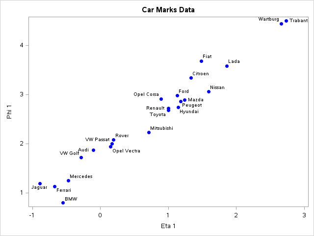

[](http://quantlet.de/)

## [](http://quantlet.de/) **MVAcancarm** [](http://quantlet.de/)

```yaml

Name of QuantLet : MVAcancarm

Published in : Applied Multivariate Statistical Analysis

Description : 'Performs a canonical correlation analysis for the car marks data and shows a plot of
the first canonical variables.'

Keywords : 'canonical, canonical-analysis, correlation, plot, graphical representation,
canonical-parameter, covariance, covariance-matrix, svd, data visualization, sas'

See also : MVAcanus, SMScancarm, SMScancarm1, SMScancarm2, SMScanfood, SMScanus

Author : Zografia Anastasiadou

Author[SAS] : Svetlana Bykovskaya

Submitted : Thu, September 11 2014 by Franziska Schulz

Submitted[SAS] : Wen, April 6 2016 by Svetlana Bykovskaya

Datafile : carmean2.dat, carmean2_sas.dat

```





### R Code:
```r

# clear all variables
rm(list = ls(all = TRUE))
graphics.off()

# read data
cardat  = read.table("carmean2.dat")

# delete first column (names of the car marks)
car     = cardat[, -1]

# define variable names
colnames(car) = c("economy", "service", "value", "price", "design", "sporty", "safety", 
    "handling")

# define car marks
rownames(car) = c("Audi", "BMW", "Citroen", "Ferrari", "Fiat", "Ford", "Hyundai", 
    "Jaguar", "Lada", "Mazda", "Mercedes", "Mitsubishi", "Nissan", "Opel Corsa", 
    "Opel Vectra", "Peugeot", "Renault", "Rover", "Toyota", "Trabant", "VW Golf", 
    "VW Passat", "Wartburg")

# reordering the columns of the matrix
cars    = cbind(car[, 4:3], car[, 1:2], car[, 5:8])
s       = cov(cars)
sa      = s[1:2, 1:2]
sb      = s[3:8, 3:8]
eiga    = eigen(sa)
eigb    = eigen(sb)
sa2     = eiga$vectors %*% diag(1/sqrt(eiga$values)) %*% t(eiga$vectors)
sb2     = eigb$vectors %*% diag(1/sqrt(eigb$values)) %*% t(eigb$vectors)
k       = sa2 %*% s[1:2, 3:8] %*% sb2
si      = svd(k)
a       = sa2 %*% si$u
b       = sb2 %*% si$v
eta     = as.matrix(cars[, 1:2]) %*% a[, 1]
phi     = as.matrix(cars[, 3:8]) %*% b[, 1]
etaphi  = cbind(eta, phi)

# plot
plot(etaphi, type = "n", xlab = "Eta 1", ylab = "Phi 1", main = "Car Marks Data", 
    cex.lab = 1.2, cex.axis = 1.2, cex.main = 1.8)
text(etaphi, rownames(car))

```

### SAS Code:
```sas

* Import the data;
data carmean2;
  infile '/folders/myfolders/data/carmean2_sas.dat';
  input temp1 $ temp2-temp9;
run;

proc iml;
  * Read data into a matrix;
  use carmean2;
    read all var _ALL_ into x; 
  close carmean2;
  
  colnames = {"economy", "service", "value", "price", "design", "sporty", "safety", 
    "handling"}; 
  rownames = {"Audi", "BMW", "Citroen", "Ferrari", "Fiat", "Ford", "Hyundai", 
    "Jaguar", "Lada", "Mazda", "Mercedes", "Mitsubishi", "Nissan", "Opel Corsa", 
    "Opel Vectra", "Peugeot", "Renault", "Rover", "Toyota", "Trabant", "VW Golf", 
    "VW Passat", "Wartburg"};
  
  * reordering the columns of the matrix;
  cars = x[, 4:3] || x[, 1:2] || x[, 5:8];
  s    = cov(cars);
  sa   = s[1:2, 1:2];
  sb   = s[3:8, 3:8];
  sa2  = eigvec(sa) * diag(1/sqrt(eigval(sa))) * eigvec(sa)`;
  sb2  = eigvec(sb) * diag(1/sqrt(eigval(sb))) * eigvec(sb)`;
  k    = sa2 * s[1:2, 3:8] * sb2;
  
  call svd(u,q,v,k);
  a    = sa2 * u;
  b    = sb2 * v;
  eta  = cars[, 1:2] * a[, 1];
  phi  = cars[, 3:8] * b[, 1];
  
  create plot var {"eta" "phi" "rownames"};
    append;
  close plot;
quit;

proc sgplot data = plot
    noautolegend;
  title 'Car Marks Data';
  scatter x = eta y = phi / markerattrs = (color = blue symbol = circlefilled)
    datalabel = rownames;
  xaxis label = 'Eta 1';
  yaxis label = 'Phi 1';
run;

```
