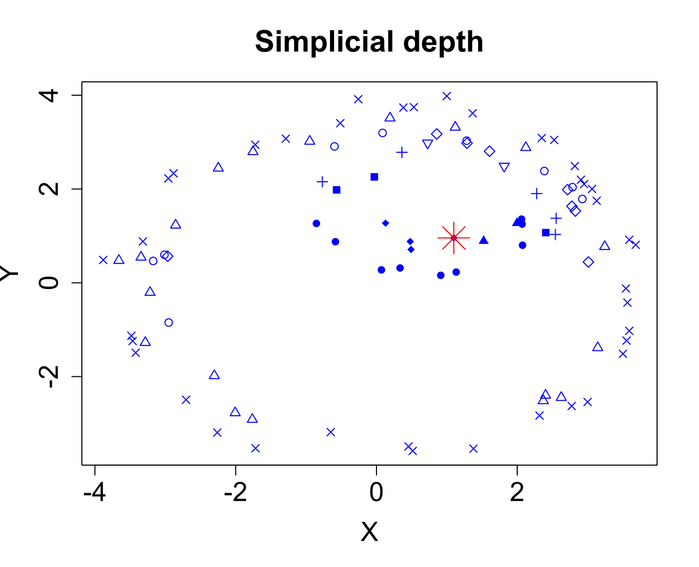

[](http://quantlet.de/)

## [](http://quantlet.de/) **MVAsimdepex** [](http://quantlet.de/)

```yaml

Name of QuantLet : MVAsimdepex

Published in : Applied Multivariate Statistical Analysis

Description : 'Calculates and plots the simplicial depth for a two-dimensional, 10 point
distribution according to depth.'

Keywords : simplicial-depth, median, distribution, plot, graphical representation

See also : MVAppsib, MVAsimdep1, MVAsir2data, MVAsirdata, MVAppexample, ppsib, ppsibexample

Author : Zografia Anastasiadou, Franziska Schulz

Submitted : Tue, February 04 2014 by Franziska Schulz

Example : 'The points with higher depth are indicated via filled shapes and the deepest point, the
two-dimensional median is indicated as a big red star in the center.'

```




### R Code:
```r

# clear all variables
rm(list = ls(all = TRUE))
graphics.off()

# install and load packages
libraries = c("depth", "localdepth")
lapply(libraries, function(x) if (!(x %in% installed.packages())) {
    install.packages(x)
})
lapply(libraries, library, quietly = TRUE, character.only = TRUE)

# parameter settings
set.seed(101)
n = 100                                 # number of observations
p = 2                                   # number of dimensions
r = matrix(c(3, 1), 1, 2)
s = matrix(c(1, 2), 1, 2)
f = 4/10

# Generate data
d = matrix(0, n, p)                     # initialize matrix
d[, 1] = c(r[, 1] + runif((1 - f) * n), r[, 2] + runif(f * n))  # uniform numbers shifted by r
d[, 2] = 6.28 * runif(n)                # the second column has 100 random numbers from uniform distribution

c = rbind(matrix(0, (1 - f) * n, 2), matrix(s, f * n, 2, byrow = TRUE))  # first 1-f rows equals to zero, last f rows equal to s

x = matrix(0, n, p)                     # initialize matrix
x[, 1] = c[, 1] + d[, 1] * cos(d[, 2])  # rotate data and shift by c
x[, 2] = c[, 2] + d[, 1] * sin(d[, 2])


# Compute the two-dimensional median
m   = med(x, method = "Liu")
mm  = m$median

# compute the size of the simplices formed from x and return the corresponding
# quantiles needed as input for the function localdepth
tau = quantile.localdepth(x, probs = 0.1, size = TRUE, use = "volume")

# compute the depth and the local depth for the set of points of x and the given threshold tau
ld = localdepth(x, tau = tau$quantile, method = "simplicial", use = "volume")
dep = ld$depth                          # vector of the depth values

# plot the result: 1 is a circle, 2 is a triangle, 3 is a cross, 4 is a X-symbol,
# 5 is a rhombus, 6 is an inverted triangle, 15 is a filled rectangle, 16 is a
# filled circle, 17 is a filled triangle, 18 is a filled rectangle
col = round(10 * dep/max(dep))
col = 4 * (col == 1) + 2 * (col == 2) + 1 * (col == 3) + 5 * (col == 4) + 6 * (col == 
    5) + 3 * (col == 6) + 15 * (col == 7) + 16 * (col == 8) + 17 * (col == 9) + 18 * 
    (col == 10)
plot(x, pch = col, col = "blue", xlab = "X", ylab = "Y", main = "Simplicial depth", 
    cex.lab = 1.6, cex.axis = 1.6, cex.main = 1.8)
points(mm[1], mm[2], col = "red", pch = 8, cex = 3)  # median is the big red star 

```
