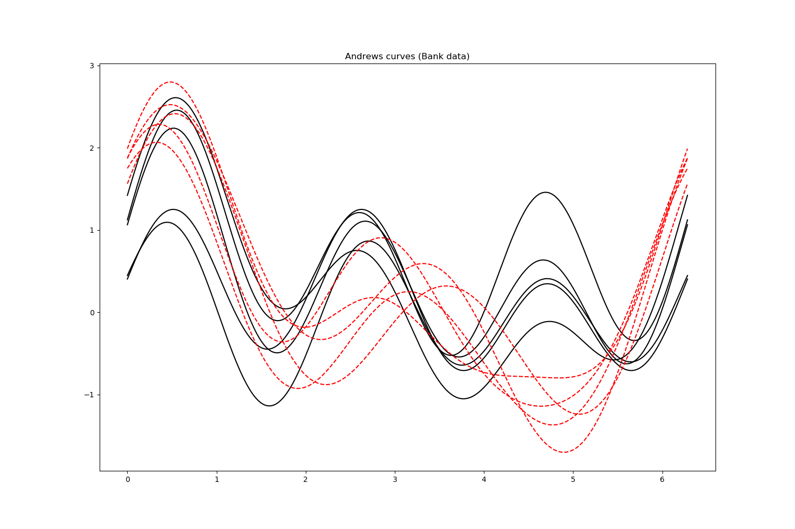

[](http://quantlet.de/)

## [](http://quantlet.de/) **MVAandcur** [](http://quantlet.de/)

```yaml

Name of QuantLet: MVAandcur

Published in: Applied Multivariate Statistical Analysis

Description: Computes Andrew's Curves for the observations 96-105 of the Swiss bank notes data. The order of the variables is 1,2,3,4,5,6.

Keywords: Andrews curves, descriptive methods, normalization, scaling, financial, plot, graphical representation, data visualization

See also: MVAandcur2, MVAparcoo1

Author[R]: anonumous
Author[Python]: "Matthias Fengler, Liudmila Gorkun-Voevoda"

Submitted[R]: Tue, September 09 2014 by Awdesch Melzer
Submitted[Python]: "Sun, March 29 2020 by Liudmila Gorkun-Voevoda"

Datafiles: bank2.dat

```




### R Code
```r


# clear variables and close windows
rm(list = ls(all = TRUE))
graphics.off()

# install and load packages
libraries = c("tourr")
lapply(libraries, function(x) if (!(x %in% installed.packages())) {
install.packages(x)
})
lapply(libraries, library, quietly = TRUE, character.only = TRUE)

# load data
data = read.table("bank2.dat")
x = data[96:105, ]
y = NULL
i = 1

while (i <= 6) {
    z = (x[, i] - min(x[, i]))/(max(x[, i]) - min(x[, i]))  # zero-one scaling
    y = cbind(y, z)
    i = i + 1
}

Type = c(rep(1, 5), rep(2, 5))
f = as.integer(Type)
grid = seq(0, 2 * pi, length = 1000)

# plot
plot(grid, andrews(y[1, ])(grid), type = "l", lwd = 1.5, main = "Andrews curves (Bank data)", 
    axes = FALSE, frame = TRUE, ylim = c(-0.3, 0.5), ylab = "", xlab = "")
for (i in 2:5) {
    lines(grid, andrews(y[i, ])(grid), col = "black", lwd = 1.5)
}
for (i in 6:10) {
    lines(grid, andrews(y[i, ])(grid), col = "red3", lwd = 1.5, lty = "dotted")
}
axis(side = 2, at = seq(-0.5, 0.5, 0.25), labels = seq(-0.5, 0.5, 0.25))
axis(side = 1, at = seq(0, 7, 1), labels = seq(0, 7, 1))
```

automatically created on 2020-04-22

### PYTHON Code
```python

import pandas as pd
import numpy as np
import matplotlib.pyplot as plt

data = pd.read_csv("bank2.dat", sep = "\s+", header=None)
x = data[95:105]

y = (x - x.min())/(x.max() - x.min())


def ac(x, t):
    if len(x) % 2 == 0:
        f = x[0]/np.sqrt(2)
        u = 1
        for p in range(1, int((len(x)+1)/2)):
            f += x[u]*np.sin(t*p) + x[u+1]*np.cos(t*p)
            u += 2
        f += x[u]*np.sin(t*(p+1))
        return f
    else:
        f = x[0]/np.sqrt(2)
        u = 1
        for p in range(1, int((len(x)+1)/2)):
            f += x[u]*np.sin(t*p) + x[u+1]*np.cos(t*p)
            u += 2
        return f


grid = np.linspace(0, 2*np.pi, 1000)

fig, ax = plt.subplots(figsize = (15,10))
for i in range(0, 5):
    ax.plot(grid, ac(y.iloc[i,:], grid), c = "black")
    
for i in range(5, 10):
    ax.plot(grid, ac(y.iloc[i,:], grid), c = "red", ls = "--")

plt.title("Andrews curves (Bank data)")

plt.show()


```

automatically created on 2020-04-22