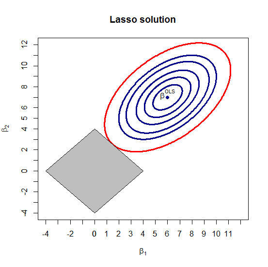
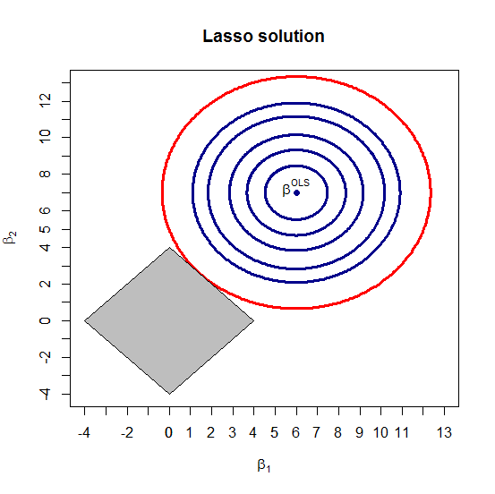

[](http://quantlet.de/)

## [](http://quantlet.de/) **MVAlassocontour** [](http://quantlet.de/)

```yaml


Name of QuantLet: MVAlassocontour

Published in: Applied Multivariate Statistical Analysis

Description: 'Plots the Lasso solution under the least squares loss function. The contour plots of the quadratic form objective function are produced which are centered at the least squares solution (beta_1,beta_2)^t = (6,7)^t in the two-dimensional case for the case of both the non-orthonormal and orthonormal design. The tuning parameter s being equal to 4.'

Keywords: contour, least-squares, lasso, lasso shrinkage, plot, graphical representation

See also: LCPvariance, MVAlassologit, MVAlassoregress, SMSlassocar, SMSlassoridge

Author: Sergey Nasekin

Author[Python]: 'Matthias Fengler, Liudmila Gorkun-Voevoda'

Submitted: Sun, May 03 2015 by Awdesch Melzer

Submitted[Python]: 'Wed, April 22 2020 by Liudmila Gorkun-Voevoda'

Input: 
- s : lasso tuning parameter 
- orthonorm : logical (1 if orthonormal design is required to be plotted, 0 if non-orthonormal)
- beta : basic OLS solution around which the quadratic form objective function is centered.

Example: 
- 1: Lasso solution in the general design case.
- 2: Lasso solution in the orthonormal design case.

```







### R Code
```r


# clear variables and close windows
rm(list = ls(all = TRUE))
graphics.off()

# install and load packages
libraries = c("clusterGeneration", "ellipse", "MASS")
lapply(libraries, function(x) if (!(x %in% installed.packages())) {
    install.packages(x)
})
lapply(libraries, library, quietly = TRUE, character.only = TRUE)

orthonorm = 0
s = 4
beta = c(6, 7)

# plot 
if (orthonorm == 1) {
    corrmat = matrix(c(1, 0, 0, 1), nrow = 2, ncol = 2)
    ellip1 = ellipse(x = corrmat, scale = c(2.45, 2.45), centre = c(beta[1], beta[2]), 
        level = 0.965, npoints = 500)
    plot(-3:10, -3:10, type = "n", xlim = c(-4, 13), ylim = c(-4, 13), xlab = expression(beta[1]), 
        ylab = expression(beta[2]), main = "Lasso solution")
    axis(1, -4:13, labels = TRUE)
    axis(2, -4:13, labels = TRUE)
} else if (orthonorm == 0) {
    corrmat = matrix(c(1, 0.5, 0.5, 1), nrow = 2, ncol = 2)
    ellip1 = ellipse(x = corrmat, scale = c(2, 2), centre = c(6, 7), level = 0.965, 
        npoints = 500)
    plot(-3:10, -3:10, type = "n", xlim = c(-4, 12), ylim = c(-4, 12), xlab = expression(beta[1]), 
        ylab = expression(beta[2]), main = "Lasso solution")
    axis(1, -4:12, labels = TRUE)
    axis(2, -4:12, labels = TRUE)
} else {
    paste("Give either 1 or 0")
}
lines(ellip1, type = "l", col = "red", lwd = 3)
polygon(x = c(-s, 0, s, 0), y = c(0, s, 0, -s), col = "gray")
conflev = as.matrix(c(0.865, 0.765, 0.565, 0.365, 0.165))
if (orthonorm == 1) {
    for (i in 1:length(conflev)) {
        add = ellipse(x = corrmat, scale = c(2.45, 2.45), centre = c(6, 7), level = conflev[i], 
            npoints = 500)
        lines(add[, 1], add[, 2], col = "darkblue", lwd = 3)
    }
    points(x = 6, y = 7, pch = 16, lwd = 2, col = "darkblue")
    text(6, 7.3, expression(paste(beta^OLS)))
} else if (orthonorm == 0) {
    for (i in 1:length(conflev)) {
        add = ellipse(x = corrmat, scale = c(2, 2), centre = c(6, 7), level = conflev[i], 
            npoints = 500)
        lines(add[, 1], add[, 2], col = "darkblue", lwd = 3)
    }
    points(x = 6, y = 7, pch = 16, lwd = 2, col = "darkblue")
    text(6, 7.3, expression(paste(beta^OLS)))
} else {
    paste("Give either 1 or 0")
}

```

automatically created on 2020-04-22

### PYTHON Code
```python

import pandas as pd
import numpy as np
from scipy.stats import chi2
import matplotlib.pyplot as plt
from matplotlib.patches import Ellipse
from matplotlib.patches import Rectangle

orthonorm = 0
s = 4
beta = [6, 7]

if orthonorm == 1:
    corrmat = np.array([[1, 0], [0, 1]])
    ellip1 = Ellipse(xy = [beta[0], beta[1]], 
                     width = np.sqrt(1 + corrmat[0,1])*2*chi2.ppf(0.96, 2), 
                     height = np.sqrt(1 - corrmat[0,1])*2*chi2.ppf(0.96, 2), 
                     facecolor = "w", edgecolor = "r", zorder = 0)
elif orthonorm == 0:
    corrmat = np.array([[1, 0.5], [0.5, 1]])
    ellip1 = Ellipse(xy = [beta[0], beta[1]], 
                     width = np.sqrt(1 + corrmat[0,1])*1.62*chi2.ppf(0.96, 2), 
                     height = np.sqrt(1 - corrmat[0,1])*1.62*chi2.ppf(0.96, 2), 
                     angle = 45,
                     facecolor = "w", edgecolor = "r", zorder = 0)
else:
    print("Give either 1 or 0")
    
conflev = [0.86, 0.76, 0.56, 0.36]

fig, ax = plt.subplots(figsize = (10,10))
ax.add_patch(ellip1)
ax.add_patch(Rectangle(xy = (0, -s), width = s*np.sqrt(2), height = s*np.sqrt(2), angle=45, facecolor = "grey"))

if orthonorm == 1:
    for i in conflev:
        ax.add_patch(Ellipse(xy = [beta[0], beta[1]], width = np.sqrt(1 + corrmat[0,1])*2*chi2.ppf(i, 2), 
                             height = np.sqrt(1 - corrmat[0,1])*2*chi2.ppf(i, 2), 
                             facecolor = "w", edgecolor = "b", angle = 45, zorder = 0))
elif orthonorm == 0:
    for i in conflev:
        ax.add_patch(Ellipse(xy = [beta[0], beta[1]], width = np.sqrt(1 + corrmat[0,1])*1.62*chi2.ppf(i, 2), 
                             height = np.sqrt(1 - corrmat[0,1])*1.62*chi2.ppf(i, 2), 
                             facecolor = "w", edgecolor = "b", angle = 45, zorder = 0))
        
ax.scatter(6, 7, c = "b", s = 5)
ax.text(5.6, 6.9, r"$\beta^{OLS}$", fontsize = 14)

ax.set_xlim(-4, 14)
ax.set_ylim(-4, 14)

ax.set_title("Lasso solution")
ax.set_xlabel(r"$\beta_1$", fontsize = 12)
ax.set_ylabel(r"$\beta_2$", fontsize = 12)

plt.show()


```

automatically created on 2020-04-22