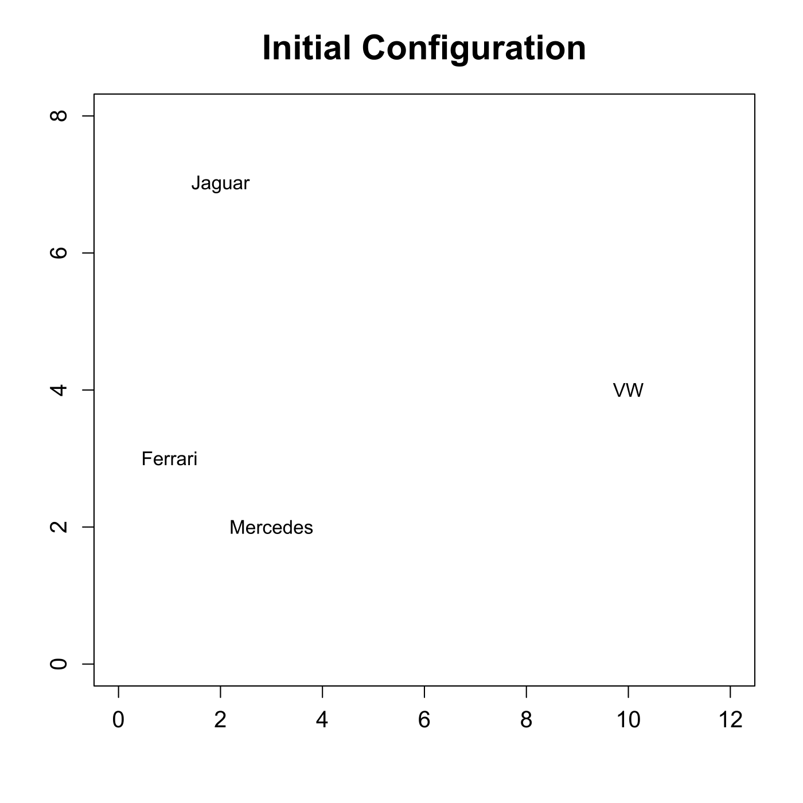
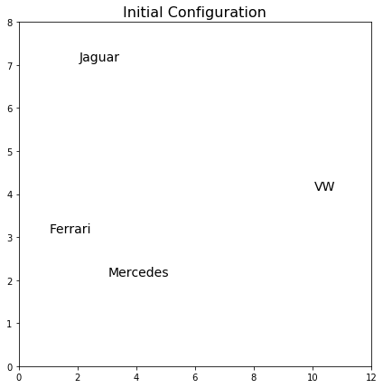
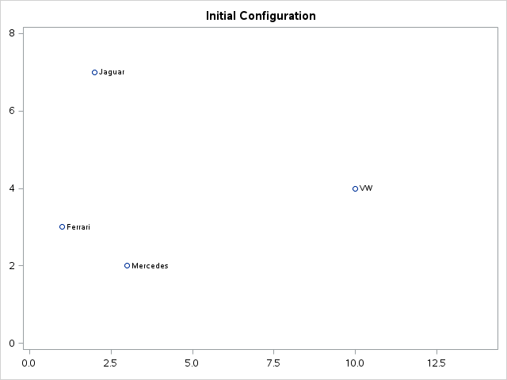

[](http://quantlet.de/)

## [](http://quantlet.de/) **MVAnmdscar1** [](http://quantlet.de/)

```yaml

Name of QuantLet: MVAnmdscar1

Published in: Applied Multivariate Statistical Analysis

Description: Plots the initial configuration of the points for nonmetric MDS for car marks data.

Keywords: MDS, non-metric-MDS, multi-dimensional, scaling, PAV, violators, plot, graphical representation, sas

See also: MVAMDScity1, MVAMDScity2, MVAMDSnonmstart, MVAMDSpooladj, MVAmdscarm, MVAnmdscar2, MVAnmdscar3, PAVAlgo, MVAcarrankings

Author: Zografia Anastasiadou
Author[SAS]: Svetlana Bykovskaya
Author[Python]: Matthias Fengler, Liudmila Gorkun-Voevoda

Submitted: Thu, November 06 2014 by Sergey Nasekin
Submitted[SAS]: Tue, April 5 2016 by Svetlana Bykovskaya
Submitted[Python]: Wed, January 6 2021 by Liudmila Gorkun-Voevoda

```







### PYTHON Code
```python

import numpy as np
import matplotlib.pyplot as plt

x = np.array([[3, 2, 1, 10], [2, 7, 3, 4]]).T
brands = ["Mercedes", "Jaguar", "Ferrari", "VW"]

fig, ax = plt.subplots(figsize = (7, 7))
ax.scatter(x[:, 0], x[:, 1], c = "w")
for i in range(0, len(x)):
    ax.text(x[i, 0]+0.05, x[i, 1]+0.1, brands[i], fontsize = 14)

plt.xlim(0, 12)
plt.ylim(0, 8)

plt.title("Initial Configuration", fontsize = 16)
plt.show()

```

automatically created on 2021-01-08

### R Code
```r


# clear all variables
rm(list = ls(all = TRUE))
graphics.off()

x = cbind(c(3, 2, 1, 10), c(2, 7, 3, 4))

# plot
plot(x, type = "n", xlim = c(0, 12), ylim = c(0, 8), xlab = "", ylab = "", main = "Initial Configuration", 
    cex.axis = 1.2, cex.main = 1.8)
text(x, labels = c("Mercedes", "Jaguar", "Ferrari", "VW"))

```

automatically created on 2021-01-08

### SAS Code
```sas

proc iml;
  x  = {3, 2, 1, 10} || {2, 7, 3, 4};
  
  x1 = x[,1];
  x2 = x[,2];
  cars = {'Mercedes', 'Jaguar', 'Ferrari', 'VW'};
	
  create plot var {"x1" "x2" "cars"};
    append;
  close plot;
quit;

proc sgplot data = plot;
  title 'Initial Configuration';
  scatter x = x1 y = x2 / datalabel = cars datalabelpos = right;
  xaxis min = 0 max = 12 display = (nolabel);
  yaxis min = 0 max = 8  display = (nolabel); 
run;
```

automatically created on 2021-01-08